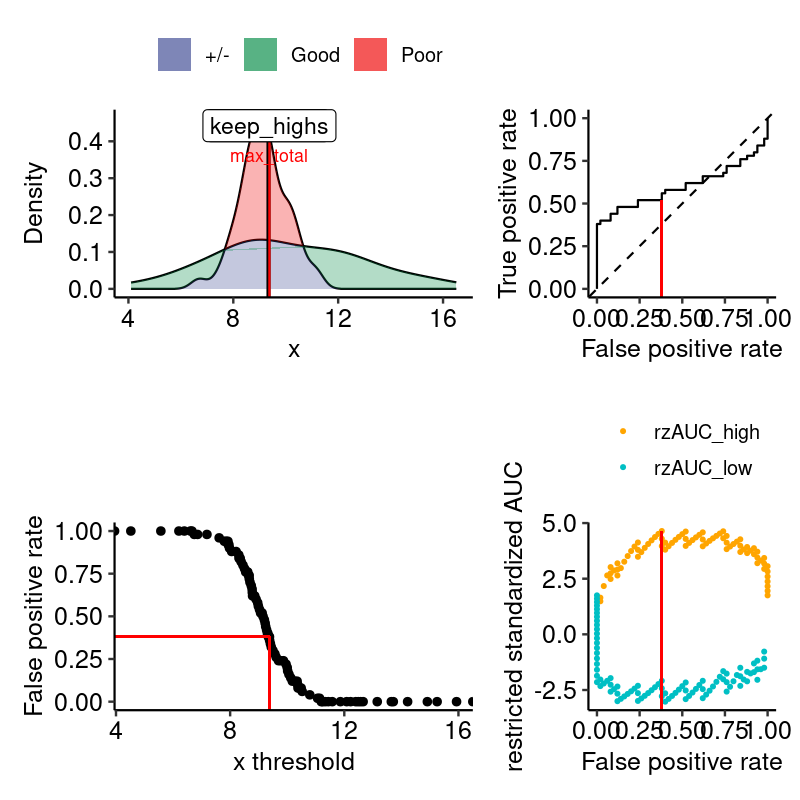

<!-- README.md is generated from README.Rmd. Please edit that file -->

# restrictedROC

<!-- badges: start -->

[](https://lifecycle.r-lib.org/articles/stages.html#experimental)
[](https://CRAN.R-project.org/package=restrictedROC)
[](https://github.com/ggrlab/restrictedROC/actions/workflows/R-CMD-check.yaml)
[](https://app.codecov.io/gh/ggrlab/restrictedROC?branch=main)
<!-- badges: end -->

The goal of restrictedROC is to provide a convenient way to calculate
restricted ROC curves and their permutation p-values.

## Installation

You can install the latest version of restrictedROC like so:

``` r
devtools::install_github("ggrlab/restrictedROC")
```

## Quickstart

Given a dataset with one dependent (outcome, binary) variable and one
independent (predictor, numeric) variables, e.g. the value of a
biomarker in two groups of patients, we want to know if the biomarker is
informative for the outcome.

``` r
set.seed(123)
biodata <- data.frame(
    outcome = factor(c(rep("Good", 50), rep("Poor", 50))),
    biomarker = c(rnorm(50, 10, 3), rnorm(50, 9, 1))
)
head(biodata)
#>   outcome biomarker
#> 1    Good  8.318573
#> 2    Good  9.309468
#> 3    Good 14.676125
#> 4    Good 10.211525
#> 5    Good 10.387863
#> 6    Good 15.145195
```

Here we use `outcome` and `biomarker` as dependent and independent
variables, respectively. `outcome` is a factor with two levels,
`biomarker` is a numeric variable.

The most convenient usage of restrictedROC is via the
`simple_rROC_permutation()` function. The most important results of
`restrictedROC::simple_rROC_permutation()` are:

  - (restricted) AUCs for all possible cutoffs of the predictor variable
  - A global and maximal (including all restrictions) AUC
  - Permutation p-values for the global and maximal AUC

<!-- end list -->

``` r
# library(restrictedROC)
set.seed(412)
res_rroc <- restrictedROC::simple_rROC_permutation(
    response = biodata$outcome,
    predictor = biodata$biomarker,
    positive_label = "Good",
    n_permutations = 100 # increase that in real data!
)
```

`res_rroc$permutation_pval` refers to the permutation p-values of:

  - `pval.twoside.global`: The global AUC when all samples are used.
    This is the usually known AUC with a calculated permutation p-value.
  - `pval.twoside.max`: This is the maximal (restricted or unrestricted)
    AUC’s permutation p-value.

<!-- end list -->

``` r
print(round(res_rroc$permutation_pval, 3))
#>    pval.twoside.max pval.twoside.global      n_permutations 
#>               0.010               0.099             100.000
```

In this particular example we see that at a significance level of 0.05,
the global AUC is insignificant, but the maximal AUC is significant.
This tells that the data should be restricted and has a **limited
informative range**.

`res_rroc$global` refers to the AUC, its variance under H0, the
standardized AUC, and its (asymptotic, not permutation\!) p-value when
using all samples without restriction.

``` r
print(res_rroc$global)
#>      auc auc_var_H0   rzAUC pval_asym
#> 1 0.6016     0.6016 1.75103 0.0799407
```

We see that the AUC is 0.6016, with a p-value of 0.08. This is not
significant at a significance level of 0.05.

`res_rroc$max_total` refers to the AUC, its variance under H0, the
standardized AUC, its (asymptotic, not permutation\!) p-value, the
threshold(=restriction value) and which part of the data is **kept** and
therefore **within the informative range**.

``` r
print(res_rroc$max_total)
#>         auc  auc_var_H0    rzAUC    pval_asym threshold part
#> 1 0.9089069 0.007759784 4.641941 3.451517e-06  9.377944 high
```

In this example, the maximal AUC is 0.9089, with a restriction value of
9.377944 and a focus on the “low” part. Therefore, the informative range
is `biomarker < 9.378`.

In particular, we observe that the AUC is much higher than the global
AUC, and that the p-value is lower. This is because the data is
restricted to the informative range and the AUC is calculated only on
the samples with values within this range.

We have a convenient way to visualize the data and the results:

``` r
grouped_data <- split(biodata$biomarker, biodata$outcome)
png("example.png", width = 800, height = 800, res = 150)
print(
    restrictedROC::plot_density_rROC_empirical(
        values_grouped = grouped_data,
        positive_label = "Good"
    )
)
#> $plots
#> 
#> $single_rROC
#> $performances
#> # A tibble: 101 × 21
#>    threshold auc_high positives_high negatives_high scaling_high auc_var_H0_high
#>        <dbl>    <dbl>          <dbl>          <dbl>        <dbl>           <dbl>
#>  1   -Inf       0.602             50             50         1            0.00337
#>  2      4.52    0.614             49             50         1.02         0.00340
#>  3      5.57    0.627             48             50         1.04         0.00344
#>  4      6.20    0.64              47             50         1.06         0.00348
#>  5      6.40    0.654             46             50         1.09         0.00351
#>  6      6.61    0.668             45             50         1.11         0.00356
#>  7      6.66    0.684             44             50         1.14         0.00360
#>  8      6.74    0.677             44             49         1.16         0.00363
#>  9      6.86    0.693             43             49         1.19         0.00368
#> 10      7.19    0.709             42             49         1.21         0.00373
#> # ℹ 91 more rows
#> # ℹ 15 more variables: rzAUC_high <dbl>, pval_asym_onesided_high <dbl>,
#> #   pval_asym_high <dbl>, auc_low <dbl>, positives_low <dbl>,
#> #   negatives_low <dbl>, scaling_low <dbl>, auc_var_H0_low <dbl>,
#> #   rzAUC_low <dbl>, pval_asym_onesided_low <dbl>, pval_asym_low <dbl>,
#> #   tp <dbl>, fp <dbl>, tpr_global <dbl>, fpr_global <dbl>
#> 
#> $global
#>      auc auc_var_H0   rzAUC pval_asym
#> 1 0.6016     0.6016 1.75103 0.0799407
#> 
#> $keep_highs
#>         auc  auc_var_H0    rzAUC    pval_asym threshold
#> 1 0.9089069 0.007759784 4.641941 3.451517e-06  9.377944
#> 
#> $keep_lows
#>         auc  auc_var_H0     rzAUC  pval_asym threshold
#> 1 0.2492063 0.006878307 -3.023958 0.00249491  9.306498
#> 
#> $max_total
#>         auc  auc_var_H0    rzAUC    pval_asym threshold part
#> 1 0.9089069 0.007759784 4.641941 3.451517e-06  9.377944 high
#> 
#> $positive_label
#> [1] "Good"
#> 
#> $pROC_full
#> 
#> Call:
#> roc.default(response = true_pred_df[["true"]], predictor = true_pred_df[["pred"]],     levels = c(FALSE, TRUE), direction = direction)
#> 
#> Data: true_pred_df[["pred"]] in 50 controls (true_pred_df[["true"]] FALSE) < 50 cases (true_pred_df[["true"]] TRUE).
#> Area under the curve: 0.6016
#> 
#> attr(,"class")
#> [1] "list"          "restrictedROC"
dev.off()
#> png 
#>   2
```



`plot_density_rROC_empirical()` effectively: 1. Calls `simple_rROC` to
perform restriction 2. Makes the results readable with
`simple_rROC_interpret()` 3. Plots the original data and the restriction
results

# How was this package created?

``` r
# for VSCode
install.packages("languageserver")
install.packages("devtools")
usethis::create_tidy_package("/home/gugl/clonedgit/ggrlab/restrictedROC")
usethis::proj_activate("/home/gugl/clonedgit/ggrlab/restrictedROC")
usethis::use_tidy_style(strict = TRUE)
usethis::use_git()
```

`usethis` tells you to envoke further github-related commands. There is
two ways to continue: 1. Create a personal access token (PAT) and use it
to authenticate with github 2. Manually push the package to github

Pushing manually works fine, but some advanced `usethis` commands won’t
work properly, therefore I will continue with the PAT.

``` r
#
usethis::create_github_token()
gitcreds::gitcreds_set() # Then enter the freshly generated token
usethis::use_github(
    organisation = "ggrlab",
    private = FALSE,
    visibility = "public"
)
```

WARNING\!\!\! If an error occurs because e.g. the repository exists
already at github, use the following instead of `usethis::use_github()`:

``` bash
git branch -M main_devel
git remote add origin git@github.com:ggrlab/restrictedROC.git
git checkout main
git merge main_devel --allow-unrelated-histories
git push -u origin main
git branch --delete main_devel
```

``` r
usethis::use_tidy_github()
usethis::use_tidy_github_actions()
# overwrite tidy's default "check-full" with "check-standard"
# to not run so many checks
usethis::use_github_action("check-standard")
usethis::use_tidy_github_labels()
usethis::use_pkgdown_github_pages()
```

Additional information:

``` r
usethis::use_author(
    given = "Gunther",
    family = "Glehr",
    email = "gunthergl@gmx.net",
    role = c("aut", "cre"),
    comment = c("ORCID" = "0000-0002-1495-9162")
)
usethis::use_lifecycle()
usethis::use_news_md()
lintr::use_lintr(type = "tidyverse")
# Change manually to:
# linters: linters_with_defaults(line_length_linter = line_length_linter(120),indentation_linter = indentation_linter(4)) # see vignette("lintr")
# encoding: "UTF-8"
```

precommit is a wonderful tool to check your code before committing it.

``` r
# https://lorenzwalthert.github.io/precommit/articles/precommit.html
# install.packages("precommit")
# bash::$ conda deactivate
# bash::$ pip3 install pre-commit
precommit::install_precommit()
precommit::use_precommit()
```

Before committing: `pre-commit install --hook-type pre-push`, then
commit.

Used packages:

``` r
usethis::use_package("ggplot2")
usethis::use_package("patchwork")
usethis::use_package("pROC")
usethis::use_package("ggpubr")
usethis::use_package("stats")
usethis::use_package("tibble")
usethis::use_package("dplyr")
usethis::use_package("labeling")
usethis::use_package("tidyr")
usethis::use_package("statmod")
usethis::use_package("future.apply")
precommit::snippet_generate("additional-deps-roxygenize")
```

# How to add information

``` r
# Use pre-commits to check your code before committing it
remotes::install_github("lorenzwalthert/precommit")
precommit::install_precommit()
precommit::use_precommit()

# Increase the versions, manually or by using usethis::use_version()
usethis::use_version("minor")
usethis::use_version("dev")

# Add new functionality and document it
# During development, have a clean R environment and run devtools::load_all() to load the current status of the package
devtools::load_all()

# After adding new functionality, run devtools::check() to update the documentation
devtools::check()
devtools::document()

# Vignettes are a great way to document your package
# Add a new vignette by running
usethis::use_vignette("vignette_name")
# Change the vignette in vignettes/vignette_name.Rmd
# Build the vignette by running
devtools::build_vignettes() # This also installs the package

# Articles
# Instead of a vignette, you can create an article, which is a term used by
# pkgdown for a vignette-like .Rmd document that is not shipped with the package,
# but that appears only in the website.
usethis::use_article("article_name")
# Further arguments of devtools::build_site() are forwarded to pkgdown::build_site():
# https://pkgdown.r-lib.org/reference/build_site.html
devtools::build_site()
devtools::build_site(devel = TRUE, lazy = TRUE) # Use this for faster iteration during development

devtools::build_readme() # This updates the README.md file from the README.Rmd
```

  - Disable pre-commit for a single commit: `git commit . -m 'quick fix'
    --no-verify`

# Troubleshooting:

## `devtools::build_vignettes` fails

    --- re-building 'first_function.Rmd' using rmarkdown
    Error: processing vignette 'first_function.Rmd' failed with diagnostics:
    unused argument (resolve_symlink = FALSE)
    --- failed re-building 'first_function.Rmd'
    
    SUMMARY: processing the following file failed:
      'first_function.Rmd'

Solution:

``` r
install.packages("xfun")
```

## Vignette xfun::isFalse() will be deprecated

What: `devtools::check()` throws the following error:

    > checking re-building of vignette outputs ... ERROR
      Error(s) in re-building vignettes:
        ...
      --- re-building 'first_function.Rmd' using rmarkdown
      Quitting from lines 11-15 (first_function.Rmd) 
      Error: processing vignette 'first_function.Rmd' failed with diagnostics:
      The function xfun::isFALSE() will be deprecated in the future. Please consider using base::isFALSE(x) or identical(x, FALSE) instead.
      --- failed re-building 'first_function.Rmd'
      
      SUMMARY: processing the following file failed:
        'first_function.Rmd'
      
      Error: Vignette re-building failed.
      Execution halted

Solution: See
<https://stackoverflow.com/questions/76081732/problem-when-converting-r-file-to-r-markdown>

``` r
install.packages("knitr")
```
