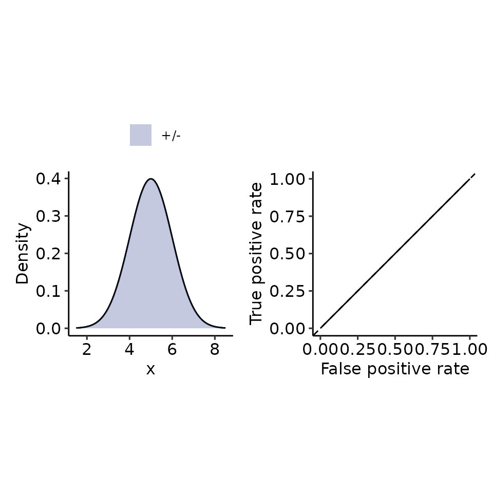
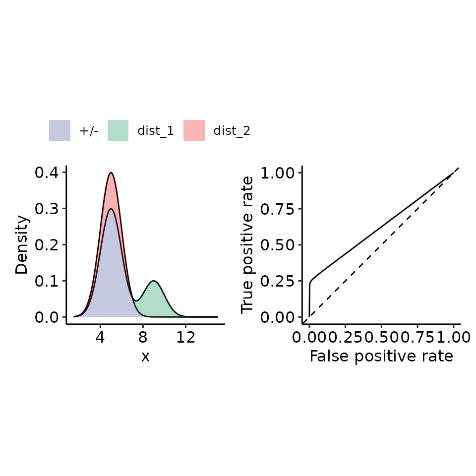
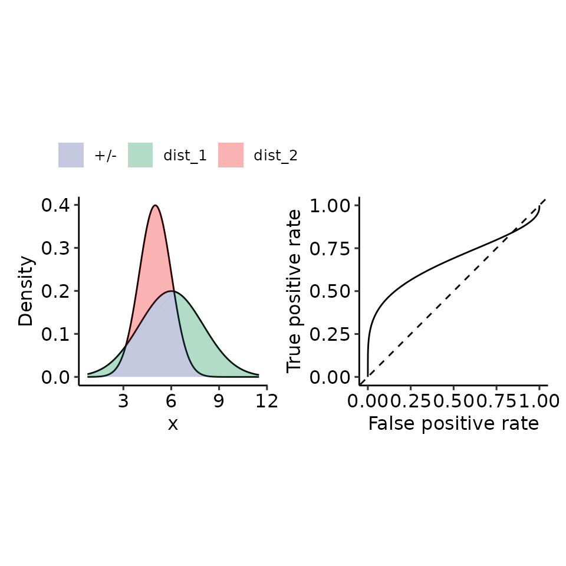

# Paper 01: ROC curves

``` r
library(restrictedROC)

size_factor <- .33
main_plotname <- "res/paper/roc"
dir.create("res/paper", recursive = TRUE)
#> Warning in dir.create("res/paper", recursive = TRUE): 'res/paper' already
#> exists
```

``` r
# 1. Random
tmp <- plot_density_ROC_str(
    dist_positive_str = "norm",
    dist_negative = "norm",
    dist_positive_args = list("mean" = 5, "sd" = 1),
    dist_negative_args = list("mean" = 5, "sd" = 1),
    xmin = 1.5, xmax = 8.5
)
print(tmp)
#> $plot
#> Ignoring unknown labels:
#> • colour : ""
```



    #> 
    #> $auc
    #> 0.5 with absolute error < 5.6e-15
    # pdf(file.path(paste0(main_plotname, "_random.pdf")), height = 10 * size_factor, width = 20 * size_factor)
    # print(tmp)
    # # $auc
    # # 0.5 with absolute error < 5.6e-15
    # dev.off()

    tmp <- plot_density_ROC_str(
        dist_positive_str = "norm",
        dist_negative = "norm",
        dist_positive_args = list("mean" = 6, "sd" = 1),
        dist_negative_args = list("mean" = 5, "sd" = 1),
        xmin = 1.5, xmax = 9.5
    )
    print(tmp)
    #> $plot
    #> Ignoring unknown labels:
    #> • colour : ""


    #> 
    #> $auc
    #> 0.76025 with absolute error < 4.9e-05
    # pdf(file.path(paste0(main_plotname, "_posGTneg.pdf")), height = 10 * size_factor, width = 20 * size_factor)
    # print(tmp)
    # # $auc
    # # 0.76025 with absolute error < 4.9e-05
    # dev.off()

    tmp <- plot_density_ROC(
        density_positive = function(x) {
            # .5 because the integral over each norm = 1, therefore for 2 densities I must half the resulting density.
            .75 * dnorm(x, mean = 5, sd = 1) + .25 * dnorm(x, mean = 9, sd = 1)
        },
        cdf_positive = function(x) {
            .75 * pnorm(x, mean = 5, sd = 1) + .25 * pnorm(x, mean = 9, sd = 1)
        },
        density_negative = function(x) dnorm(x, mean = 5, sd = 1),
        quantile_negative = function(x) qnorm(x, mean = 5, sd = 1),
        xmin = 1.5, xmax = 15
    )
    print(tmp)
    #> $plot
    #> Ignoring unknown labels:
    #> • colour : ""



    #> 
    #> $auc
    #> 0.6244153 with absolute error < 1e-06
    # pdf(file.path(paste0(main_plotname, "_pos2norm_highdiff.pdf")), height = 10 * size_factor, width = 20 * size_factor)
    # print(tmp)
    # # $auc
    # # 0.6244153 with absolute error < 1e-06
    # dev.off()

    tmp <- plot_density_ROC(
        density_positive = function(x) {
            # .5 because the integral over each norm = 1, therefore for 2 densities I must half the resulting density.
            .9 * dnorm(x, mean = 5, sd = 1) + .1 * dnorm(x, mean = 9, sd = 1)
        },
        cdf_positive = function(x) {
            .9 * pnorm(x, mean = 5, sd = 1) + .1 * pnorm(x, mean = 9, sd = 1)
        },
        density_negative = function(x) dnorm(x, mean = 5, sd = 1),
        quantile_negative = function(x) qnorm(x, mean = 5, sd = 1),
        xmin = 1.5, xmax = 15
    )
    print(tmp)
    #> $plot
    #> Ignoring unknown labels:
    #> • colour : ""


    #> 
    #> $auc
    #> 0.5497661 with absolute error < 4.1e-07
    # pdf(file.path(paste0(main_plotname, "_pos2norm_highdiff_v2.pdf")), height = 10 * size_factor, width = 20 * size_factor)
    # print(tmp)
    # # $auc
    # # 0.5497661 with absolute error < 4.1e-07
    # dev.off()


    # 4. Different mean + variance
    # 4.1 mean: positive > negative, var: positive > negative --> left-skewed
    tmp <- plot_density_ROC_str(
        dist_positive_str = "norm",
        dist_negative = "norm",
        dist_positive_args = list("mean" = 6, "sd" = 2),
        dist_negative_args = list("mean" = 5, "sd" = 1),
        xmin = 0.75, xmax = 11.5, length.out = 2001
    )
    print(tmp)
    #> $plot
    #> Ignoring unknown labels:
    #> • colour : ""



    #> 
    #> $auc
    #> 0.6726396 with absolute error < 1.3e-08
    # pdf(file.path(paste0(main_plotname, "_posGTneg_posVARGTneg.pdf")), height = 10 * size_factor, width = 20 * size_factor)
    # print(tmp)
    # # $auc
    # # 0.6726396 with absolute error < 1.3e-08
    # dev.off()

    # 4.2 mean: positive > negative, var: positive < negative --> right-skewed
    tmp <- plot_density_ROC_str(
        dist_positive_str = "norm",
        dist_negative = "norm",
        dist_positive_args = list("mean" = 6, "sd" = 1),
        dist_negative_args = list("mean" = 5, "sd" = 2),
        xmin = 0.75, xmax = 11.5, length.out = 2001
    )
    print(tmp)
    #> $plot
    #> Ignoring unknown labels:
    #> • colour : ""


    #> 
    #> $auc
    #> 0.6726396 with absolute error < 8.8e-07
    # pdf(file.path(paste0(main_plotname, "_posGTneg_posVARLTneg.pdf")), height = 10 * size_factor, width = 20 * size_factor)
    # print(tmp)
    # # $auc
    # # 0.6726396 with absolute error < 8.8e-07
    # dev.off()

    # 5. Perfect
    tmp <- plot_density_ROC_str(
        dist_positive_str = "norm",
        dist_negative = "norm",
        dist_positive_args = list("mean" = 15, "sd" = 1),
        dist_negative_args = list("mean" = 5, "sd" = 1),
        xmin = .5, xmax = 20
    )
    print(tmp)
    #> $plot
    #> Ignoring unknown labels:
    #> • colour : ""


    #> 
    #> $auc
    #> 1 with absolute error < 1.1e-14
    # pdf(file.path(paste0(main_plotname, "_perfect.pdf")), height = 10 * size_factor, width = 20 * size_factor)
    # print(tmp)
    # # $auc
    # # 1 with absolute error < 1.1e-14
    # dev.off()
