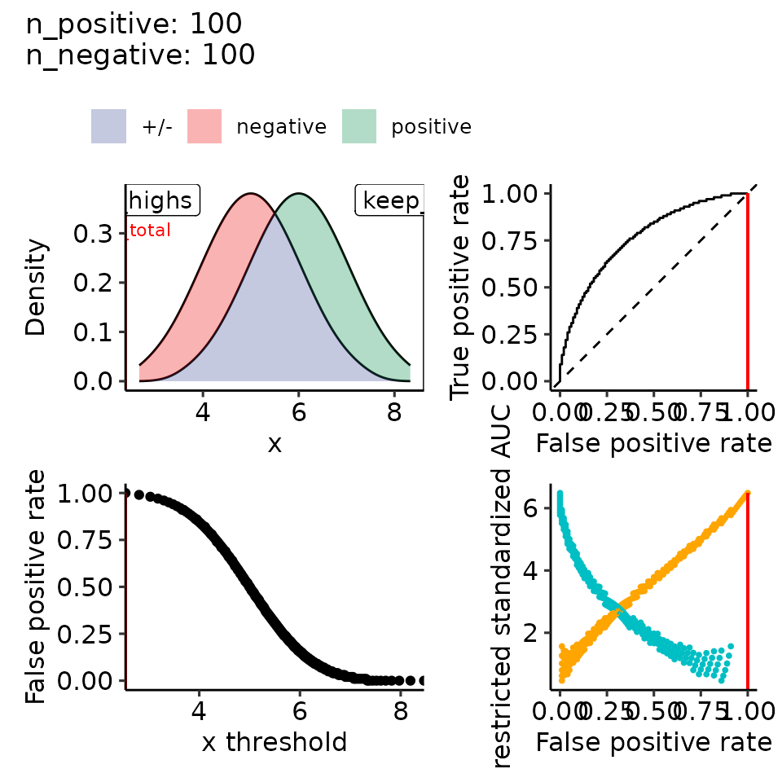
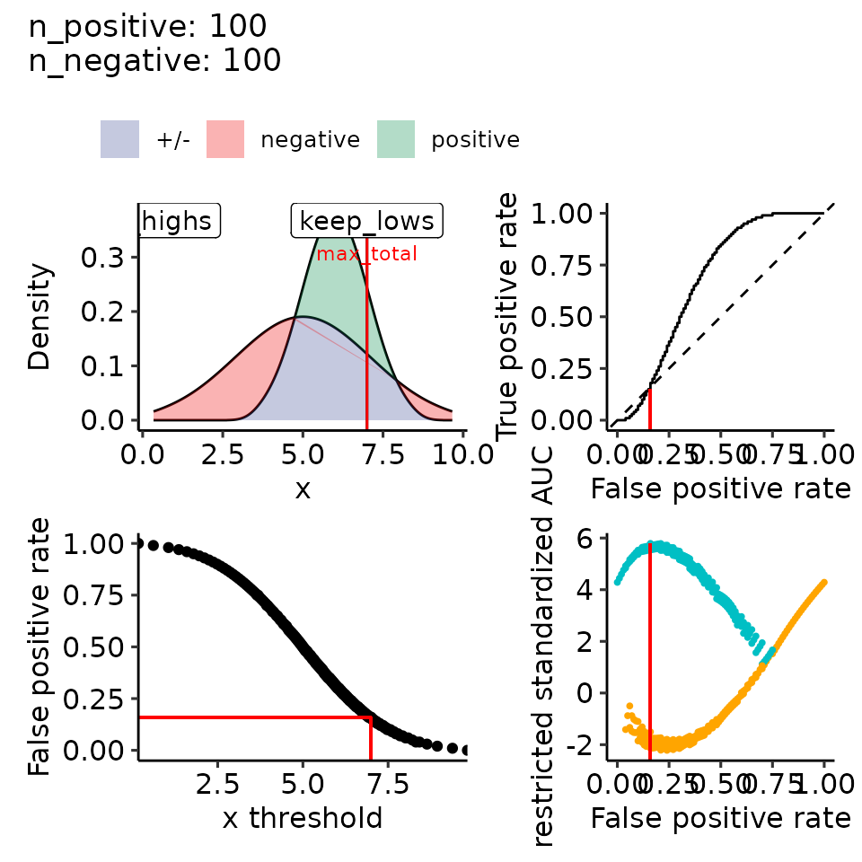

# Paper 02: rROC theoretic

``` r
library(restrictedROC)

size_factor <- .34
main_height <- 18.5
main_width <- 20
dir.create("res/paper", recursive = TRUE)
#> Warning in dir.create("res/paper", recursive = TRUE): 'res/paper' already
#> exists
main_plotname <- "res/paper/rROC"
```

``` r
n_positives <- 100
n_negatives <- 100

# 1. Random
# pdf(file.path(paste0(main_plotname, "_random.pdf")), height = main_height * size_factor, width = main_width * size_factor)
tmp <- plot_rROC_theoretical(
    qnorm_positive = function(x) qnorm(x, mean = 5, sd = 1),
    qnorm_negative = function(x) qnorm(x, mean = 5, sd = 1),
    n_positive = n_positives,
    n_negative = n_negatives,
    return_all = TRUE
)
print(tmp[["rroc"]][["single_rROC"]][["pROC_full"]])
#> 
#> Call:
#> roc.default(response = true_pred_df[["true"]], predictor = true_pred_df[["pred"]],     levels = c(FALSE, TRUE), direction = direction)
#> 
#> Data: true_pred_df[["pred"]] in 100 controls (true_pred_df[["true"]] FALSE) < 100 cases (true_pred_df[["true"]] TRUE).
#> Area under the curve: 0.5
# Call:
# roc.default(response = true_pred_df[["true"]], predictor = true_pred_df[["pred"]],     levels = c(FALSE, TRUE), direction = direction)

# Data: true_pred_df[["pred"]] in 100 controls (true_pred_df[["true"]] FALSE) < 100 cases (true_pred_df[["true"]] TRUE).
# Area under the curve: 0.5
tmp <- tmp[["rroc"]][["plots"]]
tmp <- tmp + ggplot2::ylim(c(-1, 1))
print(tmp)
#> Ignoring unknown labels:
#> • colour : ""
```


``` r
print(tmp + ggplot2::theme(legend.position = "none"))
#> Ignoring unknown labels:
#> • colour : ""
```


``` r
print(ggpubr::as_ggplot(ggpubr::get_legend(tmp)))
```


``` r
# dev.off()


# pdf(file.path(paste0(main_plotname, "_posGTneg.pdf")), height = main_height * size_factor, width = main_width * size_factor)
tmp <- plot_rROC_theoretical(
    qnorm_positive = function(x) qnorm(x, mean = 6, sd = 1),
    qnorm_negative = function(x) qnorm(x, mean = 5, sd = 1),
    n_positive = n_positives,
    n_negative = n_negatives,
    return_all = TRUE
)
print(tmp[["rroc"]][["single_rROC"]][["pROC_full"]])
#> 
#> Call:
#> roc.default(response = true_pred_df[["true"]], predictor = true_pred_df[["pred"]],     levels = c(FALSE, TRUE), direction = direction)
#> 
#> Data: true_pred_df[["pred"]] in 100 controls (true_pred_df[["true"]] FALSE) < 100 cases (true_pred_df[["true"]] TRUE).
#> Area under the curve: 0.7655
# Call:
# roc.default(response = true_pred_df[["true"]], predictor = true_pred_df[["pred"]],     levels = c(FALSE, TRUE), direction = direction)

# Data: true_pred_df[["pred"]] in 100 controls (true_pred_df[["true"]] FALSE) < 100 cases (true_pred_df[["true"]] TRUE).
# Area under the curve: 0.7655
tmp <- tmp[["rroc"]][["plots"]]
print(tmp)
#> Ignoring unknown labels:
#> • colour : ""
```


``` r
print(tmp + ggplot2::theme(legend.position = "none"))
#> Ignoring unknown labels:
#> • colour : ""
```



``` r
print(ggpubr::as_ggplot(ggpubr::get_legend(tmp)))
```


``` r
# dev.off()


# pdf(file.path(paste0(main_plotname, "_pos2norm_highdiff.pdf")), height = main_height * size_factor, width = main_width * size_factor)
tmp <- plot_rROC_theoretical(
    qnorm_positive = function(x) {
        retvec <- numeric(length(x))
        for (i in seq_along(x)) {
            if (i %% 4 == 0) {
                retvec[i] <- qnorm(x[i], 9, 1)
            } else {
                retvec[i] <- qnorm(x[i], 5, 1)
            }
        }
        return(retvec)
    },
    qnorm_negative = function(x) qnorm(x, mean = 5, sd = 1),
    n_positive = n_positives,
    n_negative = n_negatives,
    return_all = TRUE
)
print(tmp[["rroc"]][["single_rROC"]][["pROC_full"]])
#> 
#> Call:
#> roc.default(response = true_pred_df[["true"]], predictor = true_pred_df[["pred"]],     levels = c(FALSE, TRUE), direction = direction)
#> 
#> Data: true_pred_df[["pred"]] in 100 controls (true_pred_df[["true"]] FALSE) < 100 cases (true_pred_df[["true"]] TRUE).
#> Area under the curve: 0.6212
# Call:
# roc.default(response = true_pred_df[["true"]], predictor = true_pred_df[["pred"]],     levels = c(FALSE, TRUE), direction = direction)

# Data: true_pred_df[["pred"]] in 100 controls (true_pred_df[["true"]] FALSE) < 100 cases (true_pred_df[["true"]] TRUE).
# Area under the curve: 0.6212
tmp <- tmp[["rroc"]][["plots"]]
print(tmp)
#> Ignoring unknown labels:
#> • colour : ""
```


``` r
print(tmp + ggplot2::theme(legend.position = "none"))
#> Ignoring unknown labels:
#> • colour : ""
```


``` r
print(ggpubr::as_ggplot(ggpubr::get_legend(tmp)))
```


``` r
# dev.off()


# pdf(file.path(paste0(main_plotname, "_pos2norm_highdiff_v2.pdf")), height = main_height * size_factor, width = main_width * size_factor)
tmp <- plot_rROC_theoretical(
    qnorm_positive = function(x) {
        retvec <- numeric(length(x))
        for (i in seq_along(x)) {
            if (i %% 10 == 0) {
                retvec[i] <- qnorm(x[i], 9, 1)
            } else {
                retvec[i] <- qnorm(x[i], 5, 1)
            }
        }
        return(retvec)
    },
    qnorm_negative = function(x) qnorm(x, mean = 5, sd = 1),
    n_positive = n_positives,
    n_negative = n_negatives,
    return_all = TRUE
)
print(tmp[["rroc"]][["single_rROC"]][["pROC_full"]])
#> 
#> Call:
#> roc.default(response = true_pred_df[["true"]], predictor = true_pred_df[["pred"]],     levels = c(FALSE, TRUE), direction = direction)
#> 
#> Data: true_pred_df[["pred"]] in 100 controls (true_pred_df[["true"]] FALSE) < 100 cases (true_pred_df[["true"]] TRUE).
#> Area under the curve: 0.5455
# Call:
# roc.default(response = true_pred_df[["true"]], predictor = true_pred_df[["pred"]],     levels = c(FALSE, TRUE), direction = direction)

# Data: true_pred_df[["pred"]] in 100 controls (true_pred_df[["true"]] FALSE) < 100 cases (true_pred_df[["true"]] TRUE).
# Area under the curve: 0.5455
tmp <- tmp[["rroc"]][["plots"]]
print(tmp)
#> Ignoring unknown labels:
#> • colour : ""
```


``` r
print(tmp + ggplot2::theme(legend.position = "none"))
#> Ignoring unknown labels:
#> • colour : ""
```


``` r
print(ggpubr::as_ggplot(ggpubr::get_legend(tmp)))
```


``` r
# dev.off()


# # 4. Different mean + variance
# # 4.1 mean: positive > negative, var: positive > negative --> left-skewed
# pdf(file.path(paste0(main_plotname, "_posGTneg_posVARGTneg.pdf")), height = main_height * size_factor, width = main_width * size_factor)
tmp <- plot_rROC_theoretical(
    qnorm_positive = function(x) qnorm(x, mean = 6, sd = 2),
    qnorm_negative = function(x) qnorm(x, mean = 5, sd = 1),
    n_positive = n_positives,
    n_negative = n_negatives,
    return_all = TRUE
)
print(tmp[["rroc"]][["single_rROC"]][["pROC_full"]])
#> 
#> Call:
#> roc.default(response = true_pred_df[["true"]], predictor = true_pred_df[["pred"]],     levels = c(FALSE, TRUE), direction = direction)
#> 
#> Data: true_pred_df[["pred"]] in 100 controls (true_pred_df[["true"]] FALSE) < 100 cases (true_pred_df[["true"]] TRUE).
#> Area under the curve: 0.6754
# Call:
# roc.default(response = true_pred_df[["true"]], predictor = true_pred_df[["pred"]],     levels = c(FALSE, TRUE), direction = direction)

# Data: true_pred_df[["pred"]] in 100 controls (true_pred_df[["true"]] FALSE) < 100 cases (true_pred_df[["true"]] TRUE).
# Area under the curve: 0.6754
tmp <- tmp[["rroc"]][["plots"]]
print(tmp)
#> Ignoring unknown labels:
#> • colour : ""
```


``` r
print(tmp + ggplot2::theme(legend.position = "none"))
#> Ignoring unknown labels:
#> • colour : ""
```


``` r
print(ggpubr::as_ggplot(ggpubr::get_legend(tmp)))
```


``` r
# dev.off()


# # 4.2 mean: positive > negative, var: positive < negative --> right-skewed
# pdf(file.path(paste0(main_plotname, "_posGTneg_posVARLTneg.pdf")), height = main_height * size_factor, width = main_width * size_factor)
tmp <- plot_rROC_theoretical(
    qnorm_positive = function(x) qnorm(x, mean = 6, sd = 1),
    qnorm_negative = function(x) qnorm(x, mean = 5, sd = 2),
    n_positive = n_positives,
    n_negative = n_negatives,
    return_all = TRUE
)
print(tmp)
#> $data
#> $data$positive
#>   [1] 3.669921 3.942144 4.114823 4.244699 4.350327 4.440220 4.519027 4.589580
#>   [9] 4.653737 4.712786 4.767659 4.819053 4.867503 4.913432 4.957176 4.999010
#>  [17] 5.039162 5.077822 5.115150 5.151284 5.186343 5.220429 5.253633 5.286033
#>  [25] 5.317700 5.348698 5.379082 5.408903 5.438208 5.467037 5.495431 5.523423
#>  [33] 5.551047 5.578332 5.605307 5.631997 5.658428 5.684623 5.710603 5.736388
#>  [41] 5.762000 5.787457 5.812776 5.837976 5.863074 5.888085 5.913027 5.937915
#>  [49] 5.962764 5.987591 6.012409 6.037236 6.062085 6.086973 6.111915 6.136926
#>  [57] 6.162024 6.187224 6.212543 6.238000 6.263612 6.289397 6.315377 6.341572
#>  [65] 6.368003 6.394693 6.421668 6.448953 6.476577 6.504569 6.532963 6.561792
#>  [73] 6.591097 6.620918 6.651302 6.682300 6.713967 6.746367 6.779571 6.813657
#>  [81] 6.848716 6.884850 6.922178 6.960838 7.000990 7.042824 7.086568 7.132497
#>  [89] 7.180947 7.232341 7.287214 7.346263 7.410420 7.480973 7.559780 7.649673
#>  [97] 7.755301 7.885177 8.057856 8.330079
#> 
#> $data$negative
#>   [1] 0.3398422 0.8842880 1.2296459 1.4893990 1.7006546 1.8804400 2.0380547
#>   [8] 2.1791609 2.3074747 2.4255725 2.5353183 2.6381059 2.7350069 2.8268638
#>  [15] 2.9143515 2.9980202 3.0783241 3.1556436 3.2303003 3.3025689 3.3726864
#>  [22] 3.4408585 3.5072653 3.5720658 3.6354007 3.6973958 3.7581637 3.8178060
#>  [29] 3.8764151 3.9340746 3.9908614 4.0468460 4.1020934 4.1566639 4.2106136
#>  [36] 4.2639948 4.3168567 4.3692455 4.4212051 4.4727768 4.5240002 4.5749133
#>  [43] 4.6255524 4.6759524 4.7261475 4.7761707 4.8260542 4.8758298 4.9255285
#>  [50] 4.9751813 5.0248187 5.0744715 5.1241702 5.1739458 5.2238293 5.2738525
#>  [57] 5.3240476 5.3744476 5.4250867 5.4759998 5.5272232 5.5787949 5.6307545
#>  [64] 5.6831433 5.7360052 5.7893864 5.8433361 5.8979066 5.9531540 6.0091386
#>  [71] 6.0659254 6.1235849 6.1821940 6.2418363 6.3026042 6.3645993 6.4279342
#>  [78] 6.4927347 6.5591415 6.6273136 6.6974311 6.7696997 6.8443564 6.9216759
#>  [85] 7.0019798 7.0856485 7.1731362 7.2649931 7.3618941 7.4646817 7.5744275
#>  [92] 7.6925253 7.8208391 7.9619453 8.1195600 8.2993454 8.5106010 8.7703541
#>  [99] 9.1157120 9.6601578
#> 
#> 
#> $rroc
#> $rroc$plots
#> Ignoring unknown labels:
#> • colour : ""
```


    #> 
    #> $rroc$single_rROC
    #> $performances
    #> # A tibble: 201 × 21
    #>    threshold auc_high positives_high negatives_high scaling_high auc_var_H0_high
    #>        <dbl>    <dbl>          <dbl>          <dbl>        <dbl>           <dbl>
    #>  1  -Inf        0.675            100            100         1            0.00168
    #>  2     0.612    0.672            100             99         1.01         0.00168
    #>  3     1.06     0.669            100             98         1.02         0.00169
    #>  4     1.36     0.665            100             97         1.03         0.00170
    #>  5     1.60     0.662            100             96         1.04         0.00171
    #>  6     1.79     0.658            100             95         1.05         0.00172
    #>  7     1.96     0.655            100             94         1.06         0.00173
    #>  8     2.11     0.651            100             93         1.08         0.00174
    #>  9     2.24     0.647            100             92         1.09         0.00175
    #> 10     2.37     0.643            100             91         1.10         0.00176
    #> # ℹ 191 more rows
    #> # ℹ 15 more variables: rzAUC_high <dbl>, pval_asym_onesided_high <dbl>,
    #> #   pval_asym_high <dbl>, auc_low <dbl>, positives_low <dbl>,
    #> #   negatives_low <dbl>, scaling_low <dbl>, auc_var_H0_low <dbl>,
    #> #   rzAUC_low <dbl>, pval_asym_onesided_low <dbl>, pval_asym_low <dbl>,
    #> #   tp <dbl>, fp <dbl>, tpr_global <dbl>, fpr_global <dbl>
    #> 
    #> $global
    #>      auc auc_var_H0    rzAUC    pval_asym
    #> 1 0.6754     0.6754 4.285704 1.821613e-05
    #> 
    #> $keep_highs
    #>      auc auc_var_H0    rzAUC    pval_asym threshold
    #> 1 0.6754   0.001675 4.285704 1.821613e-05      -Inf
    #> 
    #> $keep_lows
    #>         auc  auc_var_H0    rzAUC    pval_asym threshold
    #> 1 0.7579832 0.001984127 5.791708 6.967407e-09  7.001485
    #> 
    #> $max_total
    #>         auc  auc_var_H0    rzAUC    pval_asym threshold part
    #> 1 0.7579832 0.001984127 5.791708 6.967407e-09  7.001485  low
    #> 
    #> $positive_label
    #> [1] "positive"
    #> 
    #> $pROC_full
    #> 
    #> Call:
    #> roc.default(response = true_pred_df[["true"]], predictor = true_pred_df[["pred"]],     levels = c(FALSE, TRUE), direction = direction)
    #> 
    #> Data: true_pred_df[["pred"]] in 100 controls (true_pred_df[["true"]] FALSE) < 100 cases (true_pred_df[["true"]] TRUE).
    #> Area under the curve: 0.6754
    #> 
    #> attr(,"class")
    #> [1] "restrictedROC" "list"
    print(tmp[["rroc"]][["single_rROC"]][["pROC_full"]])
    #> 
    #> Call:
    #> roc.default(response = true_pred_df[["true"]], predictor = true_pred_df[["pred"]],     levels = c(FALSE, TRUE), direction = direction)
    #> 
    #> Data: true_pred_df[["pred"]] in 100 controls (true_pred_df[["true"]] FALSE) < 100 cases (true_pred_df[["true"]] TRUE).
    #> Area under the curve: 0.6754
    # Call:
    # roc.default(response = true_pred_df[["true"]], predictor = true_pred_df[["pred"]],     levels = c(FALSE, TRUE), direction = direction)

    # Data: true_pred_df[["pred"]] in 100 controls (true_pred_df[["true"]] FALSE) < 100 cases (true_pred_df[["true"]] TRUE).
    # Area under the curve: 0.5
    tmp <- tmp[["rroc"]][["plots"]]
    print(tmp + ggplot2::theme(legend.position = "none"))
    #> Ignoring unknown labels:
    #> • colour : ""



``` r
print(ggpubr::as_ggplot(ggpubr::get_legend(tmp)))
```


``` r
# dev.off()
```
