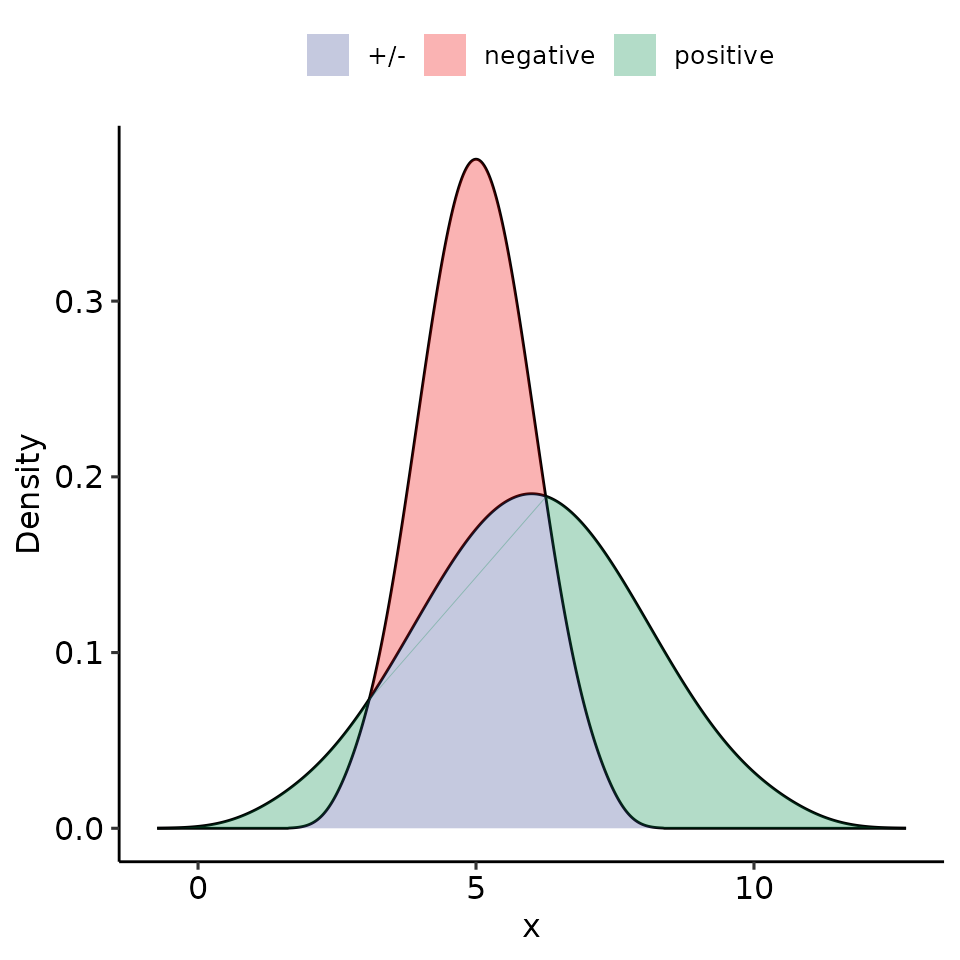
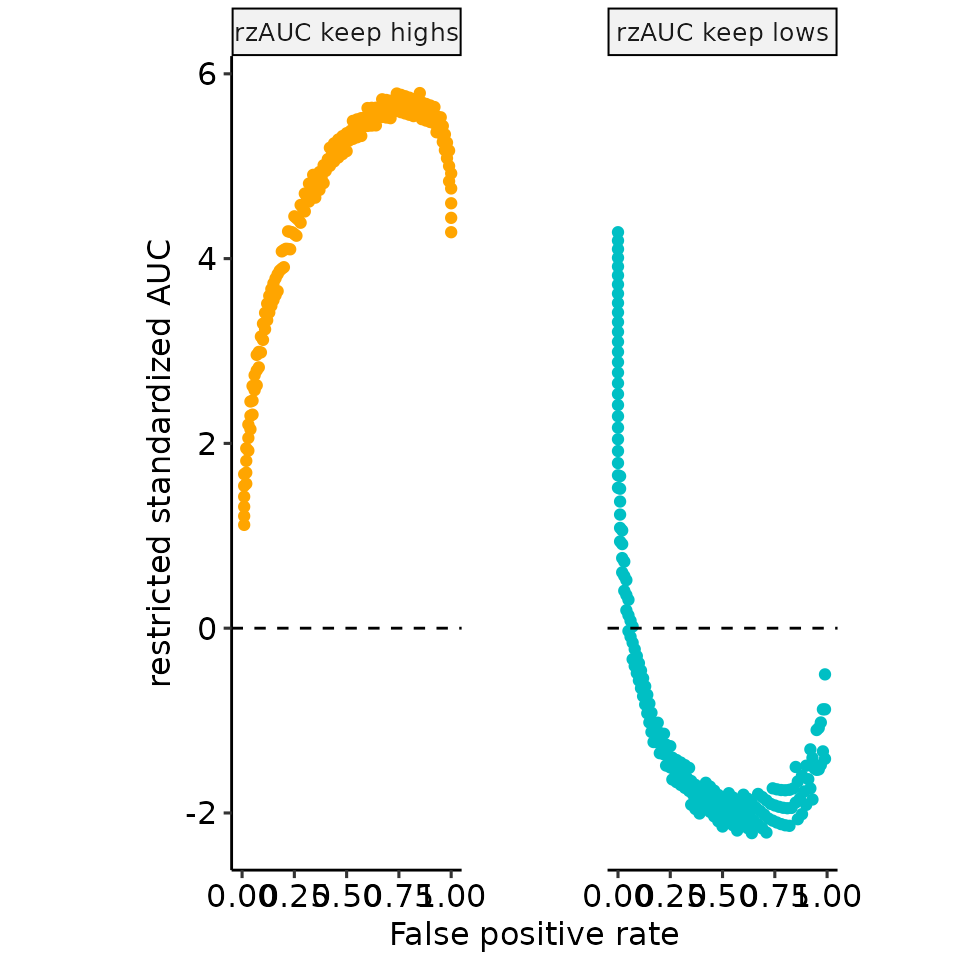
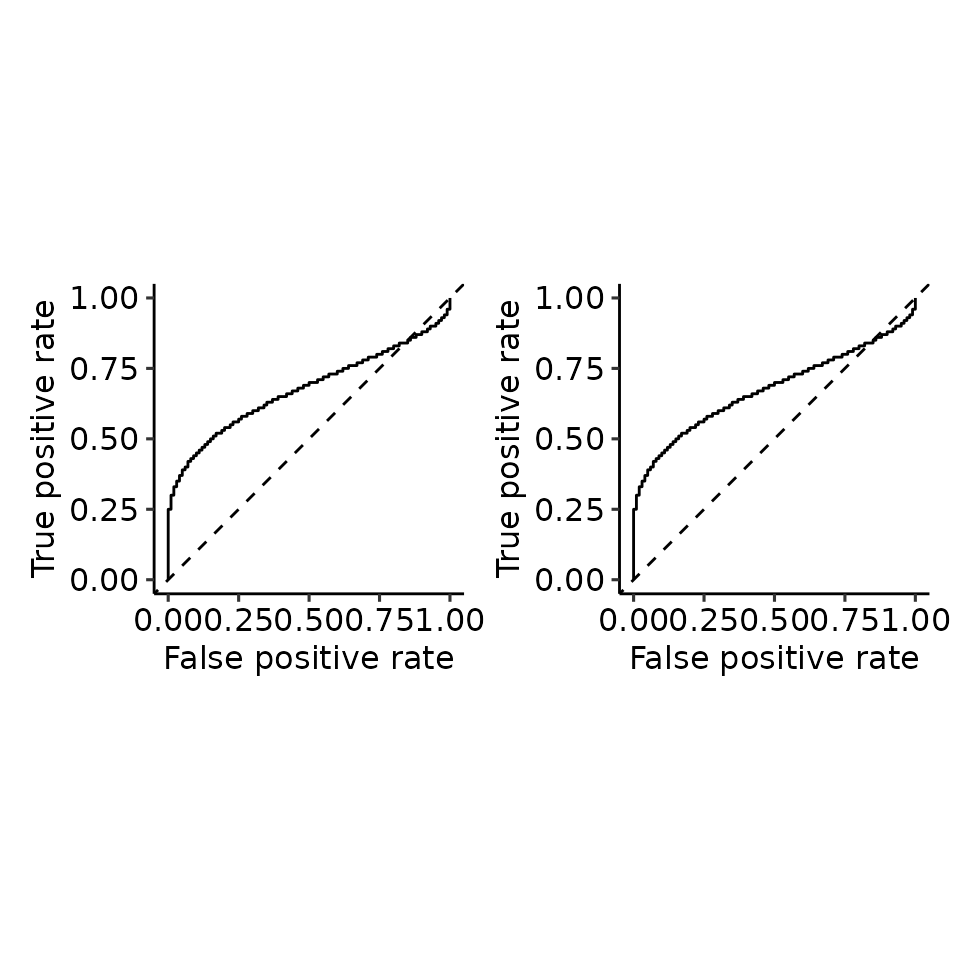

# Paper 03: rROC partROCs

``` r
library(restrictedROC)
library(dplyr)
#> 
#> Attaching package: 'dplyr'
#> The following objects are masked from 'package:stats':
#> 
#>     filter, lag
#> The following objects are masked from 'package:base':
#> 
#>     intersect, setdiff, setequal, union
library(ggplot2)

dir.create("res/paper", recursive = TRUE)
#> Warning in dir.create("res/paper", recursive = TRUE): 'res/paper' already
#> exists
```

``` r
n_positives <- 100
n_negatives <- 100

tmp <- plot_rROC_theoretical(
    qnorm_positive = function(x) qnorm(x, mean = 6, sd = 2),
    qnorm_negative = function(x) qnorm(x, mean = 5, sd = 1),
    n_positive = n_positives,
    n_negative = n_negatives,
    return_all = TRUE
)
plot_roc_full <- restrictedROC:::plot_ROC(tmp[["rroc"]][["single_rROC"]])
plot_density <- restrictedROC:::plot_density_empirical(tmp[["data"]], length.out = 500)

rz_cols <- restrictedROC:::default_part_colors
auc_cols <- restrictedROC:::default_part_colors
rzauc_cols <- restrictedROC:::default_part_colors

names(rz_cols) <- c("high" = "Keep highs", "low" = "Keep lows")[names(rz_cols)]
names(auc_cols) <- c("high" = "AUC keep highs", "low" = "AUC keep lows")[names(auc_cols)]
names(rzauc_cols) <- c("high" = "rzAUC keep highs", "low" = "rzAUC keep lows")[names(rzauc_cols)]

tmp_perf <- tmp[["rroc"]][["single_rROC"]][["performances"]]
plots_aucs <- tmp_perf %>%
    tidyr::pivot_longer(
        cols = c("auc_low", "auc_high")
    ) %>%
    dplyr::mutate(name = ifelse(name == "auc_low", "AUC keep lows", "AUC keep highs")) %>%
    ggplot(aes(x = fpr_global, y = value, col = name)) +
    geom_point() +
    ggpubr::theme_pubr() +
    facet_grid(. ~ name) +
    theme(legend.position = "none") +
    geom_hline(yintercept = 0.5, linetype = "dashed") +
    ylab("restricted AUC") +
    xlab("False positive rate") +
    scale_color_manual(values = auc_cols)
plots_rzaucs <- tmp_perf %>%
    tidyr::pivot_longer(
        cols = c("rzAUC_high", "rzAUC_low")
    ) %>%
    dplyr::mutate(name = ifelse(name == "rzAUC_low", "rzAUC keep lows", "rzAUC keep highs")) %>%
    ggplot(aes(x = fpr_global, y = value, col = name)) +
    geom_point() +
    ggpubr::theme_pubr() +
    facet_grid(. ~ name) +
    theme(legend.position = "none") +
    geom_hline(yintercept = 0, linetype = "dashed") +
    ylab("restricted standardized AUC") +
    xlab("False positive rate") +
    scale_color_manual(values = rzauc_cols)

# pdf("res/paper/rROC_posGTneg_posVARGTneg_completeexample.pdf", width = 8, height = 4)
print(plot_density)
#> Ignoring unknown labels:
#> • colour : ""
```



``` r
a <- plot_rROC_part(
    tmp[["rroc"]][["single_rROC"]],
    fpr = .68,
    include_part_auc_text = FALSE
)
#> Warning in plot_rROC_part_single(x, ...): 
#> fpr 
#>   0.68
#> not found, using the closest instead:
#>   0.68
b <- plot_rROC_part(
    tmp[["rroc"]][["single_rROC"]],
    fpr = .15,
    include_part_auc_text = FALSE
)
#> Warning in plot_rROC_part_single(x, ...): 
#> fpr 
#>   0.15
#> not found, using the closest instead:
#>   0.15
print(patchwork::wrap_plots(a[["plotlist"]][["B"]], b[["plotlist"]][["B"]]))
```


``` r
print(plots_aucs +
    theme(
        panel.spacing = unit(3.8, "lines"),
        plot.margin = unit(c(1, 16, 1, 16), "mm")
    ))
#> Warning: Removed 31 rows containing missing values or values outside the scale range
#> (`geom_point()`).
```


``` r
print(plots_rzaucs +
    theme(
        panel.spacing = unit(3.8, "lines"),
        plot.margin = unit(c(1, 16.2, 1, 19.5), "mm")
    ))
#> Warning: Removed 31 rows containing missing values or values outside the scale range
#> (`geom_point()`).
```



``` r


print(patchwork::wrap_plots(plot_roc_full, plot_roc_full))
```



``` r
print(plots_aucs +
    theme(
        panel.spacing = unit(3.7, "lines"),
        plot.margin = unit(c(1, 3.6, 1, 3.5), "mm")
    ))
#> Warning: Removed 31 rows containing missing values or values outside the scale range
#> (`geom_point()`).
```


``` r
print(plots_rzaucs +
    theme(
        panel.spacing = unit(3.7, "lines"),
        plot.margin = unit(c(1, 4, 1, 7.5), "mm")
    ))
#> Warning: Removed 31 rows containing missing values or values outside the scale range
#> (`geom_point()`).
```


``` r
# dev.off()
```
