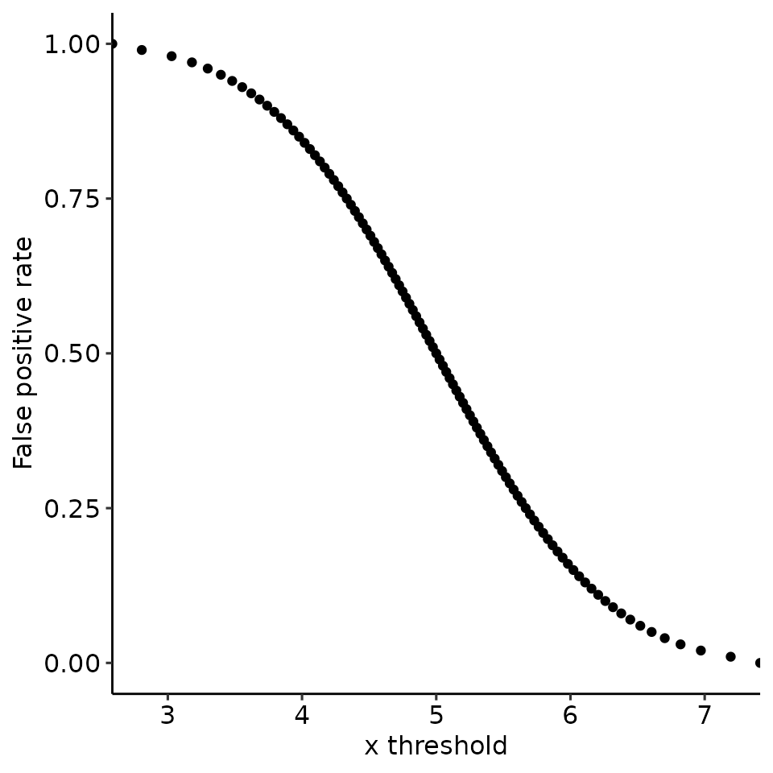
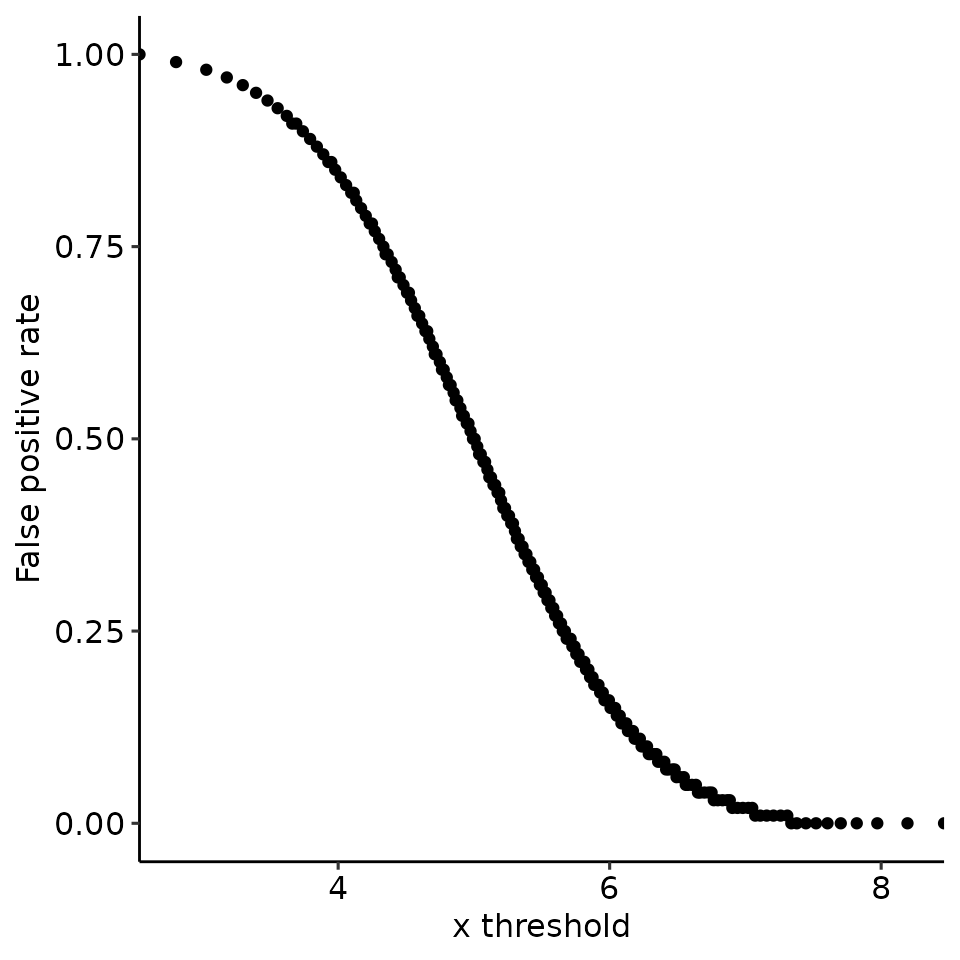
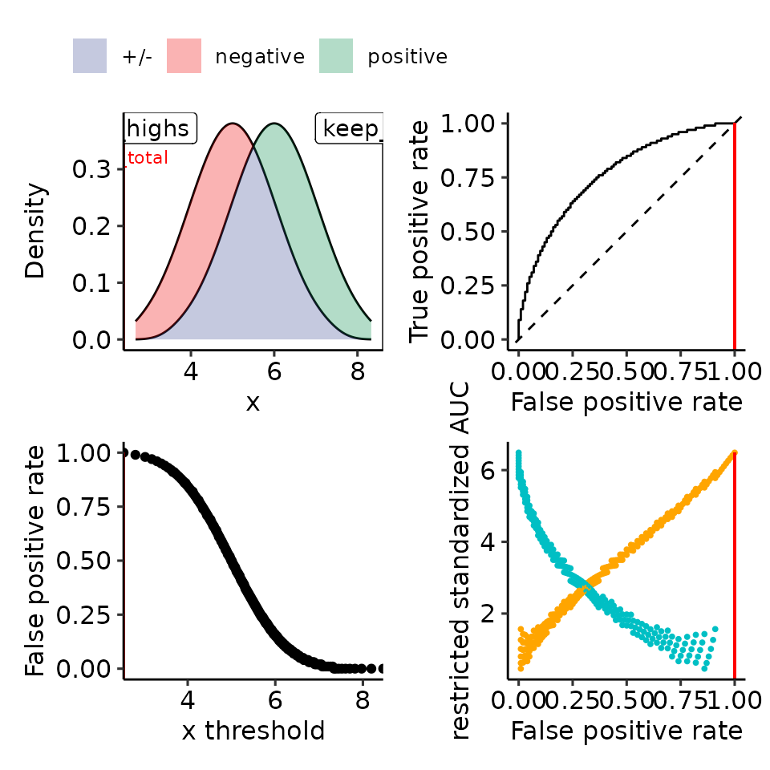
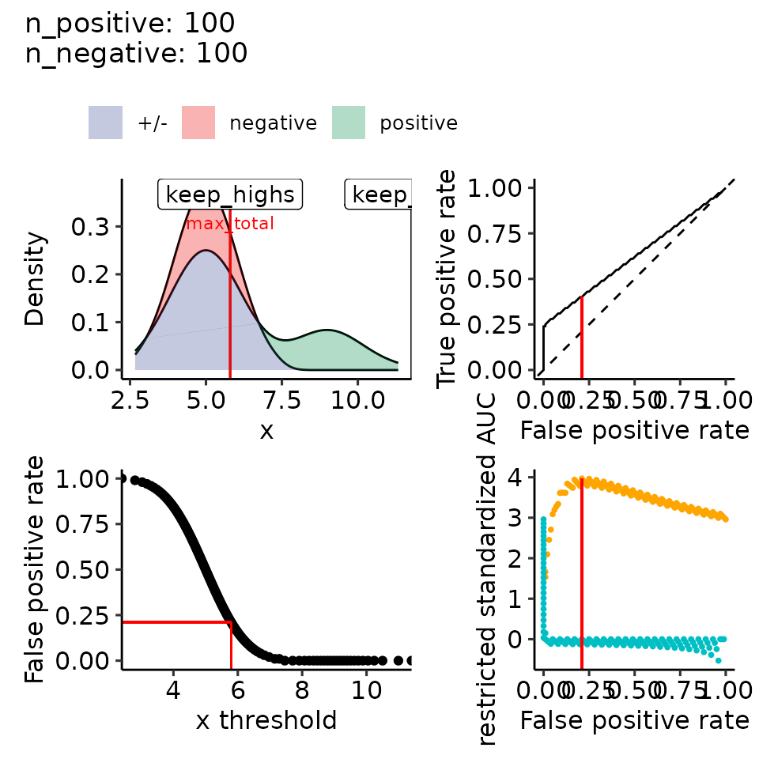
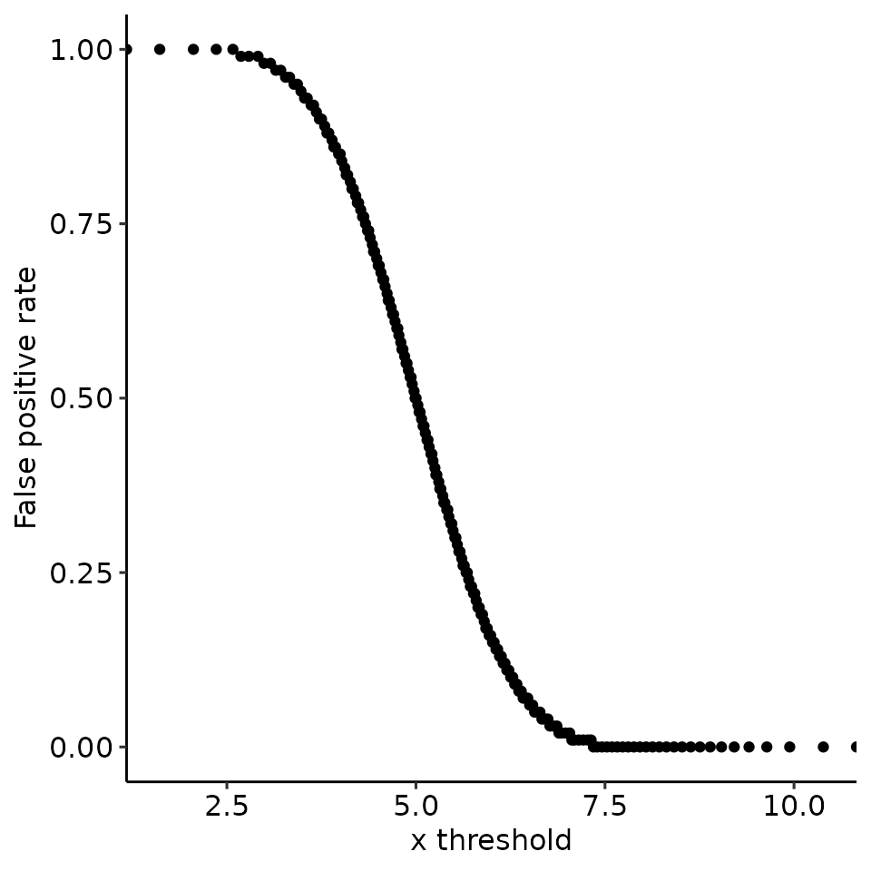
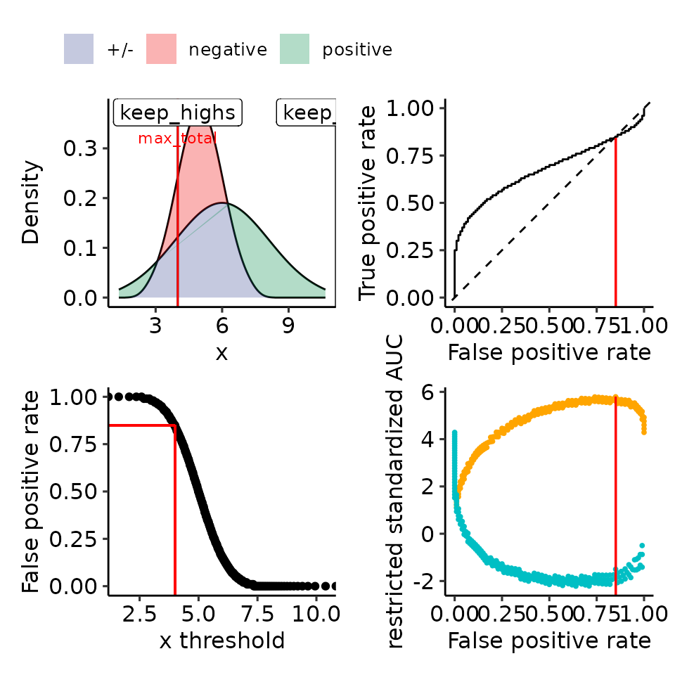
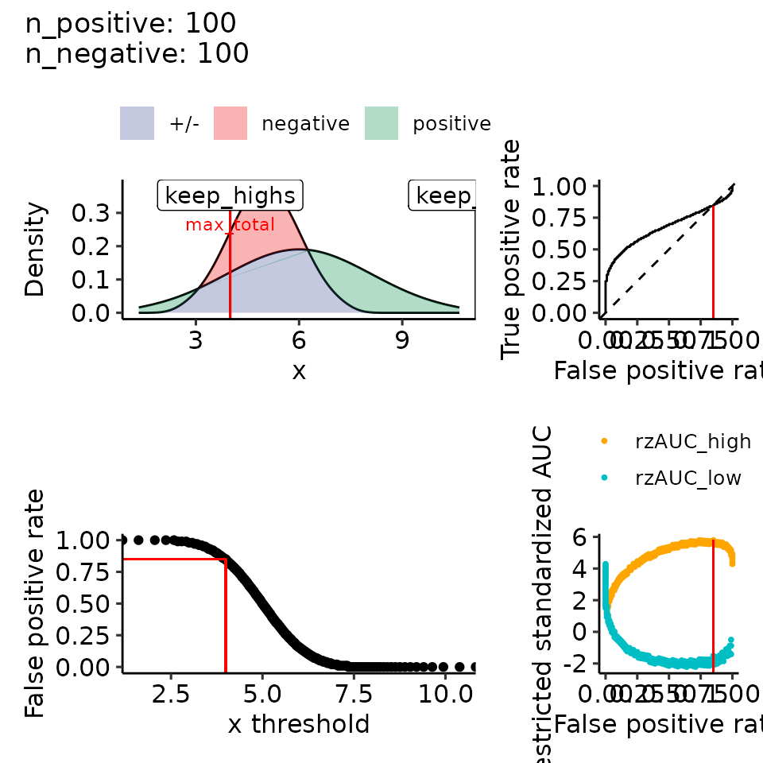
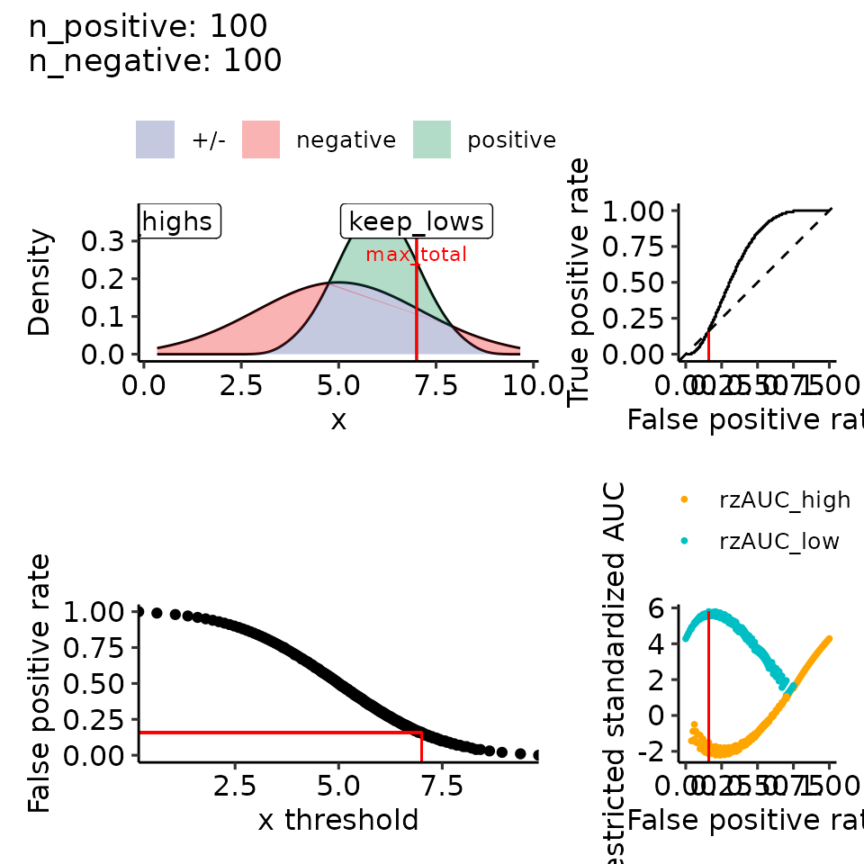
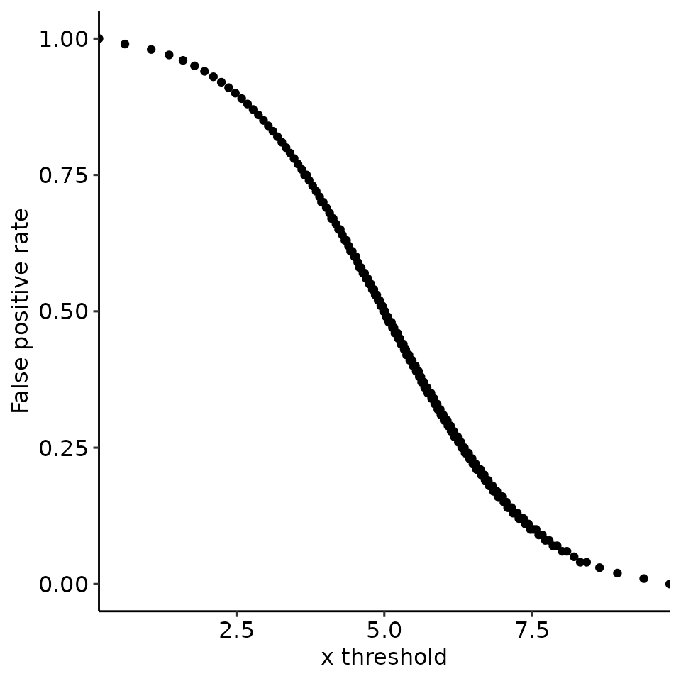

# Paper 04: rROC theoretic with FPR

``` r
library(restrictedROC)
library(ggplot2)

size_factor <- .34
main_height <- 20
main_width <- 20
dir.create("res/paper", recursive = TRUE)
#> Warning in dir.create("res/paper", recursive = TRUE): 'res/paper' already
#> exists
main_plotname <- "res/paper/rROC_fpr"
```

## Do not use the code!

This code here is not intended to be used but rather to show the
resulting plots. The usage is somewhat different to what I would
suggest. Look at the pictures, not at the code.

``` r
plots_including_fpr <- function(rroc_theo_result, rroc_ylim = NA) {
    plot_x_fpr <- ggplot(
        rroc_theo_result[["rroc"]][["single_rROC"]][["performances"]],
        aes(x = threshold, y = fpr_global)
    ) +
        geom_point() +
        ylab("False positive rate") +
        xlab("x threshold") +
        ggpubr::theme_pubr()
    srroc <- rroc_theo_result[["rroc"]][["single_rROC"]]
    max_th <- srroc$max_total$threshold
    max_rzauc <- srroc$max_total$rzAUC
    max_fpr <- srroc$performances[srroc$performances$threshold == max_th, ][["fpr_global"]]
    max_tpr <- srroc$performances[srroc$performances$threshold == max_th, ][["tpr_global"]]

    if (!all(is.na(rroc_ylim))) {
        tmp <- rroc_theo_result[["rroc"]][["plots"]] + ggplot2::ylim(rroc_ylim)
    } else {
        tmp <- rroc_theo_result[["rroc"]][["plots"]]
    }

    return(list(
        tmp,
        tmp + ggplot2::theme(legend.position = "none"),
        ggpubr::as_ggplot(ggpubr::get_legend(tmp)),
        plot_x_fpr,
        patchwork::wrap_plots(list(
            "A" = tmp[[1]],
            "B" = tmp[[3]] +
                geom_segment(x = max_fpr, xend = max_fpr, y = -Inf, yend = max_tpr, col = "red"),
            "C" = plot_x_fpr +
                geom_segment(x = max_th, xend = max_th, y = -Inf, yend = max_fpr, col = "red") +
                geom_segment(x = -Inf, xend = max_th, y = max_fpr, yend = max_fpr, col = "red"),
            "D" = tmp[[4]] +
                geom_segment(x = max_fpr, xend = max_fpr, y = -Inf, yend = max_rzauc, col = "red") +
                ggplot2::theme(legend.position = "none")
        )) +
            patchwork::plot_layout(design = "AB\nCD")
    ))
}

n_positives <- 100
n_negatives <- 100

# 1. Random
filename <- file.path(paste0(main_plotname, "_random.pdf"))
# pdf(filename, height = main_height * size_factor, width = main_width * size_factor)
rroc_theo <- plot_rROC_theoretical(
    qnorm_positive = function(x) qnorm(x, mean = 5, sd = 1),
    qnorm_negative = function(x) qnorm(x, mean = 5, sd = 1),
    n_positive = n_positives,
    n_negative = n_negatives,
    return_all = TRUE
)
print(plots_including_fpr(rroc_theo, rroc_ylim = c(-1, 1)))
#> [[1]]
#> Ignoring unknown labels:
#> • colour : ""
```


    #> 
    #> [[2]]
    #> Ignoring unknown labels:
    #> • colour : ""


    #> 
    #> [[3]]


    #> 
    #> [[4]]



    #> 
    #> [[5]]
    #> Ignoring unknown labels:
    #> • colour : ""


``` r
# dev.off()
# sink(paste0(filename, ".txt"))
print(rroc_theo)
#> $data
#> $data$positive
#>   [1] 2.669921 2.942144 3.114823 3.244699 3.350327 3.440220 3.519027 3.589580
#>   [9] 3.653737 3.712786 3.767659 3.819053 3.867503 3.913432 3.957176 3.999010
#>  [17] 4.039162 4.077822 4.115150 4.151284 4.186343 4.220429 4.253633 4.286033
#>  [25] 4.317700 4.348698 4.379082 4.408903 4.438208 4.467037 4.495431 4.523423
#>  [33] 4.551047 4.578332 4.605307 4.631997 4.658428 4.684623 4.710603 4.736388
#>  [41] 4.762000 4.787457 4.812776 4.837976 4.863074 4.888085 4.913027 4.937915
#>  [49] 4.962764 4.987591 5.012409 5.037236 5.062085 5.086973 5.111915 5.136926
#>  [57] 5.162024 5.187224 5.212543 5.238000 5.263612 5.289397 5.315377 5.341572
#>  [65] 5.368003 5.394693 5.421668 5.448953 5.476577 5.504569 5.532963 5.561792
#>  [73] 5.591097 5.620918 5.651302 5.682300 5.713967 5.746367 5.779571 5.813657
#>  [81] 5.848716 5.884850 5.922178 5.960838 6.000990 6.042824 6.086568 6.132497
#>  [89] 6.180947 6.232341 6.287214 6.346263 6.410420 6.480973 6.559780 6.649673
#>  [97] 6.755301 6.885177 7.057856 7.330079
#> 
#> $data$negative
#>   [1] 2.669921 2.942144 3.114823 3.244699 3.350327 3.440220 3.519027 3.589580
#>   [9] 3.653737 3.712786 3.767659 3.819053 3.867503 3.913432 3.957176 3.999010
#>  [17] 4.039162 4.077822 4.115150 4.151284 4.186343 4.220429 4.253633 4.286033
#>  [25] 4.317700 4.348698 4.379082 4.408903 4.438208 4.467037 4.495431 4.523423
#>  [33] 4.551047 4.578332 4.605307 4.631997 4.658428 4.684623 4.710603 4.736388
#>  [41] 4.762000 4.787457 4.812776 4.837976 4.863074 4.888085 4.913027 4.937915
#>  [49] 4.962764 4.987591 5.012409 5.037236 5.062085 5.086973 5.111915 5.136926
#>  [57] 5.162024 5.187224 5.212543 5.238000 5.263612 5.289397 5.315377 5.341572
#>  [65] 5.368003 5.394693 5.421668 5.448953 5.476577 5.504569 5.532963 5.561792
#>  [73] 5.591097 5.620918 5.651302 5.682300 5.713967 5.746367 5.779571 5.813657
#>  [81] 5.848716 5.884850 5.922178 5.960838 6.000990 6.042824 6.086568 6.132497
#>  [89] 6.180947 6.232341 6.287214 6.346263 6.410420 6.480973 6.559780 6.649673
#>  [97] 6.755301 6.885177 7.057856 7.330079
#> 
#> 
#> $rroc
#> $rroc$plots
#> Ignoring unknown labels:
#> • colour : ""
```


    #> 
    #> $rroc$single_rROC
    #> $performances
    #> # A tibble: 101 × 21
    #>    threshold auc_high positives_high negatives_high scaling_high auc_var_H0_high
    #>        <dbl>    <dbl>          <dbl>          <dbl>        <dbl>           <dbl>
    #>  1   -Inf         0.5            100            100         1            0.00168
    #>  2      2.81      0.5             99             99         1.02         0.00169
    #>  3      3.03      0.5             98             98         1.04         0.00171
    #>  4      3.18      0.5             97             97         1.06         0.00173
    #>  5      3.30      0.5             96             96         1.09         0.00175
    #>  6      3.40      0.5             95             95         1.11         0.00176
    #>  7      3.48      0.5             94             94         1.13         0.00178
    #>  8      3.55      0.5             93             93         1.16         0.00180
    #>  9      3.62      0.5             92             92         1.18         0.00182
    #> 10      3.68      0.5             91             91         1.21         0.00184
    #> # ℹ 91 more rows
    #> # ℹ 15 more variables: rzAUC_high <dbl>, pval_asym_onesided_high <dbl>,
    #> #   pval_asym_high <dbl>, auc_low <dbl>, positives_low <dbl>,
    #> #   negatives_low <dbl>, scaling_low <dbl>, auc_var_H0_low <dbl>,
    #> #   rzAUC_low <dbl>, pval_asym_onesided_low <dbl>, pval_asym_low <dbl>,
    #> #   tp <dbl>, fp <dbl>, tpr_global <dbl>, fpr_global <dbl>
    #> 
    #> $global
    #>   auc auc_var_H0 rzAUC pval_asym
    #> 1 0.5        0.5     0         1
    #> 
    #> $keep_highs
    #>   auc auc_var_H0         rzAUC pval_asym threshold
    #> 1 0.5  0.0255102 -4.865767e-15         1  6.445696
    #> 
    #> $keep_lows
    #>   auc auc_var_H0         rzAUC pval_asym threshold
    #> 1 0.5  0.0255102 -6.951096e-15         1  3.554304
    #> 
    #> $max_total
    #>   auc auc_var_H0         rzAUC pval_asym threshold part
    #> 1 0.5  0.0255102 -6.951096e-15         1  3.554304  low
    #> 
    #> $positive_label
    #> [1] "positive"
    #> 
    #> $pROC_full
    #> 
    #> Call:
    #> roc.default(response = true_pred_df[["true"]], predictor = true_pred_df[["pred"]],     levels = c(FALSE, TRUE), direction = direction)
    #> 
    #> Data: true_pred_df[["pred"]] in 100 controls (true_pred_df[["true"]] FALSE) < 100 cases (true_pred_df[["true"]] TRUE).
    #> Area under the curve: 0.5
    #> 
    #> attr(,"class")
    #> [1] "restrictedROC" "list"
    # sink()

    filename <- file.path(paste0(main_plotname, "_posGTneg.pdf"))
    # pdf(filename, height = main_height * size_factor, width = main_width * size_factor)
    rroc_theo <- plot_rROC_theoretical(
        qnorm_positive = function(x) qnorm(x, mean = 6, sd = 1),
        qnorm_negative = function(x) qnorm(x, mean = 5, sd = 1),
        n_positive = n_positives,
        n_negative = n_negatives,
        return_all = TRUE
    )
    print(plots_including_fpr(rroc_theo))
    #> [[1]]
    #> Ignoring unknown labels:
    #> • colour : ""


    #> 
    #> [[2]]
    #> Ignoring unknown labels:
    #> • colour : ""


    #> 
    #> [[3]]


    #> 
    #> [[4]]



    #> 
    #> [[5]]
    #> Ignoring unknown labels:
    #> • colour : ""



``` r
# dev.off()
# sink(paste0(filename, ".txt"))
print(rroc_theo)
#> $data
#> $data$positive
#>   [1] 3.669921 3.942144 4.114823 4.244699 4.350327 4.440220 4.519027 4.589580
#>   [9] 4.653737 4.712786 4.767659 4.819053 4.867503 4.913432 4.957176 4.999010
#>  [17] 5.039162 5.077822 5.115150 5.151284 5.186343 5.220429 5.253633 5.286033
#>  [25] 5.317700 5.348698 5.379082 5.408903 5.438208 5.467037 5.495431 5.523423
#>  [33] 5.551047 5.578332 5.605307 5.631997 5.658428 5.684623 5.710603 5.736388
#>  [41] 5.762000 5.787457 5.812776 5.837976 5.863074 5.888085 5.913027 5.937915
#>  [49] 5.962764 5.987591 6.012409 6.037236 6.062085 6.086973 6.111915 6.136926
#>  [57] 6.162024 6.187224 6.212543 6.238000 6.263612 6.289397 6.315377 6.341572
#>  [65] 6.368003 6.394693 6.421668 6.448953 6.476577 6.504569 6.532963 6.561792
#>  [73] 6.591097 6.620918 6.651302 6.682300 6.713967 6.746367 6.779571 6.813657
#>  [81] 6.848716 6.884850 6.922178 6.960838 7.000990 7.042824 7.086568 7.132497
#>  [89] 7.180947 7.232341 7.287214 7.346263 7.410420 7.480973 7.559780 7.649673
#>  [97] 7.755301 7.885177 8.057856 8.330079
#> 
#> $data$negative
#>   [1] 2.669921 2.942144 3.114823 3.244699 3.350327 3.440220 3.519027 3.589580
#>   [9] 3.653737 3.712786 3.767659 3.819053 3.867503 3.913432 3.957176 3.999010
#>  [17] 4.039162 4.077822 4.115150 4.151284 4.186343 4.220429 4.253633 4.286033
#>  [25] 4.317700 4.348698 4.379082 4.408903 4.438208 4.467037 4.495431 4.523423
#>  [33] 4.551047 4.578332 4.605307 4.631997 4.658428 4.684623 4.710603 4.736388
#>  [41] 4.762000 4.787457 4.812776 4.837976 4.863074 4.888085 4.913027 4.937915
#>  [49] 4.962764 4.987591 5.012409 5.037236 5.062085 5.086973 5.111915 5.136926
#>  [57] 5.162024 5.187224 5.212543 5.238000 5.263612 5.289397 5.315377 5.341572
#>  [65] 5.368003 5.394693 5.421668 5.448953 5.476577 5.504569 5.532963 5.561792
#>  [73] 5.591097 5.620918 5.651302 5.682300 5.713967 5.746367 5.779571 5.813657
#>  [81] 5.848716 5.884850 5.922178 5.960838 6.000990 6.042824 6.086568 6.132497
#>  [89] 6.180947 6.232341 6.287214 6.346263 6.410420 6.480973 6.559780 6.649673
#>  [97] 6.755301 6.885177 7.057856 7.330079
#> 
#> 
#> $rroc
#> $rroc$plots
#> Ignoring unknown labels:
#> • colour : ""
```


    #> 
    #> $rroc$single_rROC
    #> $performances
    #> # A tibble: 201 × 21
    #>    threshold auc_high positives_high negatives_high scaling_high auc_var_H0_high
    #>        <dbl>    <dbl>          <dbl>          <dbl>        <dbl>           <dbl>
    #>  1   -Inf       0.766            100            100         1            0.00168
    #>  2      2.81    0.763            100             99         1.01         0.00168
    #>  3      3.03    0.761            100             98         1.02         0.00169
    #>  4      3.18    0.758            100             97         1.03         0.00170
    #>  5      3.30    0.756            100             96         1.04         0.00171
    #>  6      3.40    0.753            100             95         1.05         0.00172
    #>  7      3.48    0.751            100             94         1.06         0.00173
    #>  8      3.55    0.748            100             93         1.08         0.00174
    #>  9      3.62    0.745            100             92         1.09         0.00175
    #> 10      3.66    0.742            100             91         1.10         0.00176
    #> # ℹ 191 more rows
    #> # ℹ 15 more variables: rzAUC_high <dbl>, pval_asym_onesided_high <dbl>,
    #> #   pval_asym_high <dbl>, auc_low <dbl>, positives_low <dbl>,
    #> #   negatives_low <dbl>, scaling_low <dbl>, auc_var_H0_low <dbl>,
    #> #   rzAUC_low <dbl>, pval_asym_onesided_low <dbl>, pval_asym_low <dbl>,
    #> #   tp <dbl>, fp <dbl>, tpr_global <dbl>, fpr_global <dbl>
    #> 
    #> $global
    #>      auc auc_var_H0    rzAUC   pval_asym
    #> 1 0.7655     0.7655 6.487197 8.74476e-11
    #> 
    #> $keep_highs
    #>      auc auc_var_H0    rzAUC   pval_asym threshold
    #> 1 0.7655   0.001675 6.487197 8.74476e-11      -Inf
    #> 
    #> $keep_lows
    #>      auc auc_var_H0    rzAUC   pval_asym threshold
    #> 1 0.7655   0.001675 6.487197 8.74476e-11       Inf
    #> 
    #> $max_total
    #>      auc auc_var_H0    rzAUC   pval_asym threshold   part
    #> 1 0.7655   0.001675 6.487197 8.74476e-11      -Inf global
    #> 
    #> $positive_label
    #> [1] "positive"
    #> 
    #> $pROC_full
    #> 
    #> Call:
    #> roc.default(response = true_pred_df[["true"]], predictor = true_pred_df[["pred"]],     levels = c(FALSE, TRUE), direction = direction)
    #> 
    #> Data: true_pred_df[["pred"]] in 100 controls (true_pred_df[["true"]] FALSE) < 100 cases (true_pred_df[["true"]] TRUE).
    #> Area under the curve: 0.7655
    #> 
    #> attr(,"class")
    #> [1] "restrictedROC" "list"
    # sink()


    filename <- file.path(paste0(main_plotname, "_pos2norm_highdiff.pdf"))
    # pdf(filename, height = main_height * size_factor, width = main_width * size_factor)
    rroc_theo <- plot_rROC_theoretical(
        qnorm_positive = function(x) {
            retvec <- numeric(length(x))
            for (i in seq_along(x)) {
                if (i %% 4 == 0) {
                    retvec[i] <- qnorm(x[i], 9, 1)
                } else {
                    retvec[i] <- qnorm(x[i], 5, 1)
                }
            }
            return(retvec)
        },
        qnorm_negative = function(x) qnorm(x, mean = 5, sd = 1),
        n_positive = n_positives,
        n_negative = n_negatives,
        return_all = TRUE
    )
    print(plots_including_fpr(rroc_theo))
    #> [[1]]
    #> Ignoring unknown labels:
    #> • colour : ""


    #> 
    #> [[2]]
    #> Ignoring unknown labels:
    #> • colour : ""



    #> 
    #> [[3]]


    #> 
    #> [[4]]


    #> 
    #> [[5]]
    #> Ignoring unknown labels:
    #> • colour : ""


``` r
# dev.off()
# sink(paste0(filename, ".txt"))
print(rroc_theo)
#> $data
#> $data$positive
#>   [1]  2.669921  2.942144  3.114823  7.244699  3.350327  3.440220  3.519027
#>   [8]  7.589580  3.653737  3.712786  3.767659  7.819053  3.867503  3.913432
#>  [15]  3.957176  7.999010  4.039162  4.077822  4.115150  8.151284  4.186343
#>  [22]  4.220429  4.253633  8.286033  4.317700  4.348698  4.379082  8.408903
#>  [29]  4.438208  4.467037  4.495431  8.523423  4.551047  4.578332  4.605307
#>  [36]  8.631997  4.658428  4.684623  4.710603  8.736388  4.762000  4.787457
#>  [43]  4.812776  8.837976  4.863074  4.888085  4.913027  8.937915  4.962764
#>  [50]  4.987591  5.012409  9.037236  5.062085  5.086973  5.111915  9.136926
#>  [57]  5.162024  5.187224  5.212543  9.238000  5.263612  5.289397  5.315377
#>  [64]  9.341572  5.368003  5.394693  5.421668  9.448953  5.476577  5.504569
#>  [71]  5.532963  9.561792  5.591097  5.620918  5.651302  9.682300  5.713967
#>  [78]  5.746367  5.779571  9.813657  5.848716  5.884850  5.922178  9.960838
#>  [85]  6.000990  6.042824  6.086568 10.132497  6.180947  6.232341  6.287214
#>  [92] 10.346263  6.410420  6.480973  6.559780 10.649673  6.755301  6.885177
#>  [99]  7.057856 11.330079
#> 
#> $data$negative
#>   [1] 2.669921 2.942144 3.114823 3.244699 3.350327 3.440220 3.519027 3.589580
#>   [9] 3.653737 3.712786 3.767659 3.819053 3.867503 3.913432 3.957176 3.999010
#>  [17] 4.039162 4.077822 4.115150 4.151284 4.186343 4.220429 4.253633 4.286033
#>  [25] 4.317700 4.348698 4.379082 4.408903 4.438208 4.467037 4.495431 4.523423
#>  [33] 4.551047 4.578332 4.605307 4.631997 4.658428 4.684623 4.710603 4.736388
#>  [41] 4.762000 4.787457 4.812776 4.837976 4.863074 4.888085 4.913027 4.937915
#>  [49] 4.962764 4.987591 5.012409 5.037236 5.062085 5.086973 5.111915 5.136926
#>  [57] 5.162024 5.187224 5.212543 5.238000 5.263612 5.289397 5.315377 5.341572
#>  [65] 5.368003 5.394693 5.421668 5.448953 5.476577 5.504569 5.532963 5.561792
#>  [73] 5.591097 5.620918 5.651302 5.682300 5.713967 5.746367 5.779571 5.813657
#>  [81] 5.848716 5.884850 5.922178 5.960838 6.000990 6.042824 6.086568 6.132497
#>  [89] 6.180947 6.232341 6.287214 6.346263 6.410420 6.480973 6.559780 6.649673
#>  [97] 6.755301 6.885177 7.057856 7.330079
#> 
#> 
#> $rroc
#> $rroc$plots
#> Ignoring unknown labels:
#> • colour : ""
```


    #> 
    #> $rroc$single_rROC
    #> $performances
    #> # A tibble: 126 × 21
    #>    threshold auc_high positives_high negatives_high scaling_high auc_var_H0_high
    #>        <dbl>    <dbl>          <dbl>          <dbl>        <dbl>           <dbl>
    #>  1   -Inf       0.621            100            100         1            0.00168
    #>  2      2.81    0.624             99             99         1.02         0.00169
    #>  3      3.03    0.626             98             98         1.04         0.00171
    #>  4      3.18    0.629             97             97         1.06         0.00173
    #>  5      3.30    0.625             97             96         1.07         0.00174
    #>  6      3.40    0.627             96             95         1.10         0.00175
    #>  7      3.48    0.630             95             94         1.12         0.00177
    #>  8      3.55    0.633             94             93         1.14         0.00179
    #>  9      3.62    0.629             94             92         1.16         0.00180
    #> 10      3.68    0.632             93             91         1.18         0.00182
    #> # ℹ 116 more rows
    #> # ℹ 15 more variables: rzAUC_high <dbl>, pval_asym_onesided_high <dbl>,
    #> #   pval_asym_high <dbl>, auc_low <dbl>, positives_low <dbl>,
    #> #   negatives_low <dbl>, scaling_low <dbl>, auc_var_H0_low <dbl>,
    #> #   rzAUC_low <dbl>, pval_asym_onesided_low <dbl>, pval_asym_low <dbl>,
    #> #   tp <dbl>, fp <dbl>, tpr_global <dbl>, fpr_global <dbl>
    #> 
    #> $global
    #>       auc auc_var_H0    rzAUC   pval_asym
    #> 1 0.62115    0.62115 2.960166 0.003074737
    #> 
    #> $keep_highs
    #>         auc  auc_var_H0    rzAUC    pval_asym threshold
    #> 1 0.8113095 0.006150794 3.969418 7.204841e-05  5.796614
    #> 
    #> $keep_lows
    #>       auc auc_var_H0    rzAUC   pval_asym threshold
    #> 1 0.62115   0.001675 2.960166 0.003074737       Inf
    #> 
    #> $max_total
    #>         auc  auc_var_H0    rzAUC    pval_asym threshold part
    #> 1 0.8113095 0.006150794 3.969418 7.204841e-05  5.796614 high
    #> 
    #> $positive_label
    #> [1] "positive"
    #> 
    #> $pROC_full
    #> 
    #> Call:
    #> roc.default(response = true_pred_df[["true"]], predictor = true_pred_df[["pred"]],     levels = c(FALSE, TRUE), direction = direction)
    #> 
    #> Data: true_pred_df[["pred"]] in 100 controls (true_pred_df[["true"]] FALSE) < 100 cases (true_pred_df[["true"]] TRUE).
    #> Area under the curve: 0.6212
    #> 
    #> attr(,"class")
    #> [1] "restrictedROC" "list"
    # sink()


    filename <- file.path(paste0(main_plotname, "_pos2norm_highdiff_v2.pdf"))
    # pdf(filename, height = main_height * size_factor, width = main_width * size_factor)
    rroc_theo <- plot_rROC_theoretical(
        qnorm_positive = function(x) {
            retvec <- numeric(length(x))
            for (i in seq_along(x)) {
                if (i %% 10 == 0) {
                    retvec[i] <- qnorm(x[i], 9, 1)
                } else {
                    retvec[i] <- qnorm(x[i], 5, 1)
                }
            }
            return(retvec)
        },
        qnorm_negative = function(x) qnorm(x, mean = 5, sd = 1),
        n_positive = n_positives,
        n_negative = n_negatives,
        return_all = TRUE
    )
    print(plots_including_fpr(rroc_theo))
    #> [[1]]
    #> Ignoring unknown labels:
    #> • colour : ""


    #> 
    #> [[2]]
    #> Ignoring unknown labels:
    #> • colour : ""


    #> 
    #> [[3]]


    #> 
    #> [[4]]


    #> 
    #> [[5]]
    #> Ignoring unknown labels:
    #> • colour : ""


``` r
# dev.off()
# sink(paste0(filename, ".txt"))
print(rroc_theo)
#> $data
#> $data$positive
#>   [1]  2.669921  2.942144  3.114823  3.244699  3.350327  3.440220  3.519027
#>   [8]  3.589580  3.653737  7.712786  3.767659  3.819053  3.867503  3.913432
#>  [15]  3.957176  3.999010  4.039162  4.077822  4.115150  8.151284  4.186343
#>  [22]  4.220429  4.253633  4.286033  4.317700  4.348698  4.379082  4.408903
#>  [29]  4.438208  8.467037  4.495431  4.523423  4.551047  4.578332  4.605307
#>  [36]  4.631997  4.658428  4.684623  4.710603  8.736388  4.762000  4.787457
#>  [43]  4.812776  4.837976  4.863074  4.888085  4.913027  4.937915  4.962764
#>  [50]  8.987591  5.012409  5.037236  5.062085  5.086973  5.111915  5.136926
#>  [57]  5.162024  5.187224  5.212543  9.238000  5.263612  5.289397  5.315377
#>  [64]  5.341572  5.368003  5.394693  5.421668  5.448953  5.476577  9.504569
#>  [71]  5.532963  5.561792  5.591097  5.620918  5.651302  5.682300  5.713967
#>  [78]  5.746367  5.779571  9.813657  5.848716  5.884850  5.922178  5.960838
#>  [85]  6.000990  6.042824  6.086568  6.132497  6.180947 10.232341  6.287214
#>  [92]  6.346263  6.410420  6.480973  6.559780  6.649673  6.755301  6.885177
#>  [99]  7.057856 11.330079
#> 
#> $data$negative
#>   [1] 2.669921 2.942144 3.114823 3.244699 3.350327 3.440220 3.519027 3.589580
#>   [9] 3.653737 3.712786 3.767659 3.819053 3.867503 3.913432 3.957176 3.999010
#>  [17] 4.039162 4.077822 4.115150 4.151284 4.186343 4.220429 4.253633 4.286033
#>  [25] 4.317700 4.348698 4.379082 4.408903 4.438208 4.467037 4.495431 4.523423
#>  [33] 4.551047 4.578332 4.605307 4.631997 4.658428 4.684623 4.710603 4.736388
#>  [41] 4.762000 4.787457 4.812776 4.837976 4.863074 4.888085 4.913027 4.937915
#>  [49] 4.962764 4.987591 5.012409 5.037236 5.062085 5.086973 5.111915 5.136926
#>  [57] 5.162024 5.187224 5.212543 5.238000 5.263612 5.289397 5.315377 5.341572
#>  [65] 5.368003 5.394693 5.421668 5.448953 5.476577 5.504569 5.532963 5.561792
#>  [73] 5.591097 5.620918 5.651302 5.682300 5.713967 5.746367 5.779571 5.813657
#>  [81] 5.848716 5.884850 5.922178 5.960838 6.000990 6.042824 6.086568 6.132497
#>  [89] 6.180947 6.232341 6.287214 6.346263 6.410420 6.480973 6.559780 6.649673
#>  [97] 6.755301 6.885177 7.057856 7.330079
#> 
#> 
#> $rroc
#> $rroc$plots
#> Ignoring unknown labels:
#> • colour : ""
```


    #> 
    #> $rroc$single_rROC
    #> $performances
    #> # A tibble: 111 × 21
    #>    threshold auc_high positives_high negatives_high scaling_high auc_var_H0_high
    #>        <dbl>    <dbl>          <dbl>          <dbl>        <dbl>           <dbl>
    #>  1   -Inf       0.546            100            100         1            0.00168
    #>  2      2.81    0.546             99             99         1.02         0.00169
    #>  3      3.03    0.547             98             98         1.04         0.00171
    #>  4      3.18    0.548             97             97         1.06         0.00173
    #>  5      3.30    0.549             96             96         1.09         0.00175
    #>  6      3.40    0.550             95             95         1.11         0.00176
    #>  7      3.48    0.551             94             94         1.13         0.00178
    #>  8      3.55    0.553             93             93         1.16         0.00180
    #>  9      3.62    0.554             92             92         1.18         0.00182
    #> 10      3.68    0.555             91             91         1.21         0.00184
    #> # ℹ 101 more rows
    #> # ℹ 15 more variables: rzAUC_high <dbl>, pval_asym_onesided_high <dbl>,
    #> #   pval_asym_high <dbl>, auc_low <dbl>, positives_low <dbl>,
    #> #   negatives_low <dbl>, scaling_low <dbl>, auc_var_H0_low <dbl>,
    #> #   rzAUC_low <dbl>, pval_asym_onesided_low <dbl>, pval_asym_low <dbl>,
    #> #   tp <dbl>, fp <dbl>, tpr_global <dbl>, fpr_global <dbl>
    #> 
    #> $global
    #>      auc auc_var_H0    rzAUC pval_asym
    #> 1 0.5455     0.5455 1.111742 0.2662491
    #> 
    #> $keep_highs
    #>         auc auc_var_H0    rzAUC  pval_asym threshold
    #> 1 0.7631579 0.01236045 2.367006 0.01793265  6.206644
    #> 
    #> $keep_lows
    #>      auc auc_var_H0    rzAUC pval_asym threshold
    #> 1 0.5455   0.001675 1.111742 0.2662491       Inf
    #> 
    #> $max_total
    #>         auc auc_var_H0    rzAUC  pval_asym threshold part
    #> 1 0.7631579 0.01236045 2.367006 0.01793265  6.206644 high
    #> 
    #> $positive_label
    #> [1] "positive"
    #> 
    #> $pROC_full
    #> 
    #> Call:
    #> roc.default(response = true_pred_df[["true"]], predictor = true_pred_df[["pred"]],     levels = c(FALSE, TRUE), direction = direction)
    #> 
    #> Data: true_pred_df[["pred"]] in 100 controls (true_pred_df[["true"]] FALSE) < 100 cases (true_pred_df[["true"]] TRUE).
    #> Area under the curve: 0.5455
    #> 
    #> attr(,"class")
    #> [1] "restrictedROC" "list"
    # sink()

    # 4. Different mean + variance
    # 4.1 mean: positive > negative, var: positive > negative --> left-skewed
    filename <- file.path(paste0(main_plotname, "_posGTneg_posVARGTneg.pdf"))
    # pdf(filename, height = main_height * size_factor, width = main_width * size_factor)
    rroc_theo <- plot_rROC_theoretical(
        qnorm_positive = function(x) qnorm(x, mean = 6, sd = 2),
        qnorm_negative = function(x) qnorm(x, mean = 5, sd = 1),
        n_positive = n_positives,
        n_negative = n_negatives,
        return_all = TRUE
    )
    print(plots_including_fpr(rroc_theo))
    #> [[1]]
    #> Ignoring unknown labels:
    #> • colour : ""


    #> 
    #> [[2]]
    #> Ignoring unknown labels:
    #> • colour : ""


    #> 
    #> [[3]]


    #> 
    #> [[4]]



    #> 
    #> [[5]]
    #> Ignoring unknown labels:
    #> • colour : ""



``` r
# dev.off()
# sink(paste0(filename, ".txt"))
print(rroc_theo)
#> $data
#> $data$positive
#>   [1]  1.339842  1.884288  2.229646  2.489399  2.700655  2.880440  3.038055
#>   [8]  3.179161  3.307475  3.425573  3.535318  3.638106  3.735007  3.826864
#>  [15]  3.914352  3.998020  4.078324  4.155644  4.230300  4.302569  4.372686
#>  [22]  4.440858  4.507265  4.572066  4.635401  4.697396  4.758164  4.817806
#>  [29]  4.876415  4.934075  4.990861  5.046846  5.102093  5.156664  5.210614
#>  [36]  5.263995  5.316857  5.369246  5.421205  5.472777  5.524000  5.574913
#>  [43]  5.625552  5.675952  5.726148  5.776171  5.826054  5.875830  5.925528
#>  [50]  5.975181  6.024819  6.074472  6.124170  6.173946  6.223829  6.273852
#>  [57]  6.324048  6.374448  6.425087  6.476000  6.527223  6.578795  6.630754
#>  [64]  6.683143  6.736005  6.789386  6.843336  6.897907  6.953154  7.009139
#>  [71]  7.065925  7.123585  7.182194  7.241836  7.302604  7.364599  7.427934
#>  [78]  7.492735  7.559142  7.627314  7.697431  7.769700  7.844356  7.921676
#>  [85]  8.001980  8.085648  8.173136  8.264993  8.361894  8.464682  8.574427
#>  [92]  8.692525  8.820839  8.961945  9.119560  9.299345  9.510601  9.770354
#>  [99] 10.115712 10.660158
#> 
#> $data$negative
#>   [1] 2.669921 2.942144 3.114823 3.244699 3.350327 3.440220 3.519027 3.589580
#>   [9] 3.653737 3.712786 3.767659 3.819053 3.867503 3.913432 3.957176 3.999010
#>  [17] 4.039162 4.077822 4.115150 4.151284 4.186343 4.220429 4.253633 4.286033
#>  [25] 4.317700 4.348698 4.379082 4.408903 4.438208 4.467037 4.495431 4.523423
#>  [33] 4.551047 4.578332 4.605307 4.631997 4.658428 4.684623 4.710603 4.736388
#>  [41] 4.762000 4.787457 4.812776 4.837976 4.863074 4.888085 4.913027 4.937915
#>  [49] 4.962764 4.987591 5.012409 5.037236 5.062085 5.086973 5.111915 5.136926
#>  [57] 5.162024 5.187224 5.212543 5.238000 5.263612 5.289397 5.315377 5.341572
#>  [65] 5.368003 5.394693 5.421668 5.448953 5.476577 5.504569 5.532963 5.561792
#>  [73] 5.591097 5.620918 5.651302 5.682300 5.713967 5.746367 5.779571 5.813657
#>  [81] 5.848716 5.884850 5.922178 5.960838 6.000990 6.042824 6.086568 6.132497
#>  [89] 6.180947 6.232341 6.287214 6.346263 6.410420 6.480973 6.559780 6.649673
#>  [97] 6.755301 6.885177 7.057856 7.330079
#> 
#> 
#> $rroc
#> $rroc$plots
#> Ignoring unknown labels:
#> • colour : ""
```



    #> 
    #> $rroc$single_rROC
    #> $performances
    #> # A tibble: 201 × 21
    #>    threshold auc_high positives_high negatives_high scaling_high auc_var_H0_high
    #>        <dbl>    <dbl>          <dbl>          <dbl>        <dbl>           <dbl>
    #>  1   -Inf       0.675            100            100         1            0.00168
    #>  2      1.61    0.682             99            100         1.01         0.00168
    #>  3      2.06    0.689             98            100         1.02         0.00169
    #>  4      2.36    0.696             97            100         1.03         0.00170
    #>  5      2.58    0.704             96            100         1.04         0.00171
    #>  6      2.69    0.701             96             99         1.05         0.00172
    #>  7      2.79    0.708             95             99         1.06         0.00173
    #>  8      2.91    0.715             94             99         1.07         0.00174
    #>  9      2.99    0.713             94             98         1.09         0.00175
    #> 10      3.08    0.720             93             98         1.10         0.00176
    #> # ℹ 191 more rows
    #> # ℹ 15 more variables: rzAUC_high <dbl>, pval_asym_onesided_high <dbl>,
    #> #   pval_asym_high <dbl>, auc_low <dbl>, positives_low <dbl>,
    #> #   negatives_low <dbl>, scaling_low <dbl>, auc_var_H0_low <dbl>,
    #> #   rzAUC_low <dbl>, pval_asym_onesided_low <dbl>, pval_asym_low <dbl>,
    #> #   tp <dbl>, fp <dbl>, tpr_global <dbl>, fpr_global <dbl>
    #> 
    #> $global
    #>      auc auc_var_H0    rzAUC    pval_asym
    #> 1 0.6754     0.6754 4.285704 1.821613e-05
    #> 
    #> $keep_highs
    #>         auc  auc_var_H0    rzAUC    pval_asym threshold
    #> 1 0.7579832 0.001984127 5.791708 6.967407e-09  3.998515
    #> 
    #> $keep_lows
    #>      auc auc_var_H0    rzAUC    pval_asym threshold
    #> 1 0.6754   0.001675 4.285704 1.821613e-05       Inf
    #> 
    #> $max_total
    #>         auc  auc_var_H0    rzAUC    pval_asym threshold part
    #> 1 0.7579832 0.001984127 5.791708 6.967407e-09  3.998515 high
    #> 
    #> $positive_label
    #> [1] "positive"
    #> 
    #> $pROC_full
    #> 
    #> Call:
    #> roc.default(response = true_pred_df[["true"]], predictor = true_pred_df[["pred"]],     levels = c(FALSE, TRUE), direction = direction)
    #> 
    #> Data: true_pred_df[["pred"]] in 100 controls (true_pred_df[["true"]] FALSE) < 100 cases (true_pred_df[["true"]] TRUE).
    #> Area under the curve: 0.6754
    #> 
    #> attr(,"class")
    #> [1] "restrictedROC" "list"
    # sink()

    # 4.2 mean: positive > negative, var: positive < negative --> right-skewed
    filename <- file.path(paste0(main_plotname, "_posGTneg_posVARLTneg.pdf"))
    # pdf(filename, height = main_height * size_factor, width = main_width * size_factor)
    rroc_theo <- plot_rROC_theoretical(
        qnorm_positive = function(x) qnorm(x, mean = 6, sd = 1),
        qnorm_negative = function(x) qnorm(x, mean = 5, sd = 2),
        n_positive = n_positives,
        n_negative = n_negatives,
        return_all = TRUE
    )
    print(plots_including_fpr(rroc_theo))
    #> [[1]]
    #> Ignoring unknown labels:
    #> • colour : ""



    #> 
    #> [[2]]
    #> Ignoring unknown labels:
    #> • colour : ""


    #> 
    #> [[3]]


    #> 
    #> [[4]]



    #> 
    #> [[5]]
    #> Ignoring unknown labels:
    #> • colour : ""


``` r
# dev.off()
# sink(paste0(filename, ".txt"))
print(rroc_theo)
#> $data
#> $data$positive
#>   [1] 3.669921 3.942144 4.114823 4.244699 4.350327 4.440220 4.519027 4.589580
#>   [9] 4.653737 4.712786 4.767659 4.819053 4.867503 4.913432 4.957176 4.999010
#>  [17] 5.039162 5.077822 5.115150 5.151284 5.186343 5.220429 5.253633 5.286033
#>  [25] 5.317700 5.348698 5.379082 5.408903 5.438208 5.467037 5.495431 5.523423
#>  [33] 5.551047 5.578332 5.605307 5.631997 5.658428 5.684623 5.710603 5.736388
#>  [41] 5.762000 5.787457 5.812776 5.837976 5.863074 5.888085 5.913027 5.937915
#>  [49] 5.962764 5.987591 6.012409 6.037236 6.062085 6.086973 6.111915 6.136926
#>  [57] 6.162024 6.187224 6.212543 6.238000 6.263612 6.289397 6.315377 6.341572
#>  [65] 6.368003 6.394693 6.421668 6.448953 6.476577 6.504569 6.532963 6.561792
#>  [73] 6.591097 6.620918 6.651302 6.682300 6.713967 6.746367 6.779571 6.813657
#>  [81] 6.848716 6.884850 6.922178 6.960838 7.000990 7.042824 7.086568 7.132497
#>  [89] 7.180947 7.232341 7.287214 7.346263 7.410420 7.480973 7.559780 7.649673
#>  [97] 7.755301 7.885177 8.057856 8.330079
#> 
#> $data$negative
#>   [1] 0.3398422 0.8842880 1.2296459 1.4893990 1.7006546 1.8804400 2.0380547
#>   [8] 2.1791609 2.3074747 2.4255725 2.5353183 2.6381059 2.7350069 2.8268638
#>  [15] 2.9143515 2.9980202 3.0783241 3.1556436 3.2303003 3.3025689 3.3726864
#>  [22] 3.4408585 3.5072653 3.5720658 3.6354007 3.6973958 3.7581637 3.8178060
#>  [29] 3.8764151 3.9340746 3.9908614 4.0468460 4.1020934 4.1566639 4.2106136
#>  [36] 4.2639948 4.3168567 4.3692455 4.4212051 4.4727768 4.5240002 4.5749133
#>  [43] 4.6255524 4.6759524 4.7261475 4.7761707 4.8260542 4.8758298 4.9255285
#>  [50] 4.9751813 5.0248187 5.0744715 5.1241702 5.1739458 5.2238293 5.2738525
#>  [57] 5.3240476 5.3744476 5.4250867 5.4759998 5.5272232 5.5787949 5.6307545
#>  [64] 5.6831433 5.7360052 5.7893864 5.8433361 5.8979066 5.9531540 6.0091386
#>  [71] 6.0659254 6.1235849 6.1821940 6.2418363 6.3026042 6.3645993 6.4279342
#>  [78] 6.4927347 6.5591415 6.6273136 6.6974311 6.7696997 6.8443564 6.9216759
#>  [85] 7.0019798 7.0856485 7.1731362 7.2649931 7.3618941 7.4646817 7.5744275
#>  [92] 7.6925253 7.8208391 7.9619453 8.1195600 8.2993454 8.5106010 8.7703541
#>  [99] 9.1157120 9.6601578
#> 
#> 
#> $rroc
#> $rroc$plots
#> Ignoring unknown labels:
#> • colour : ""
```


    #> 
    #> $rroc$single_rROC
    #> $performances
    #> # A tibble: 201 × 21
    #>    threshold auc_high positives_high negatives_high scaling_high auc_var_H0_high
    #>        <dbl>    <dbl>          <dbl>          <dbl>        <dbl>           <dbl>
    #>  1  -Inf        0.675            100            100         1            0.00168
    #>  2     0.612    0.672            100             99         1.01         0.00168
    #>  3     1.06     0.669            100             98         1.02         0.00169
    #>  4     1.36     0.665            100             97         1.03         0.00170
    #>  5     1.60     0.662            100             96         1.04         0.00171
    #>  6     1.79     0.658            100             95         1.05         0.00172
    #>  7     1.96     0.655            100             94         1.06         0.00173
    #>  8     2.11     0.651            100             93         1.08         0.00174
    #>  9     2.24     0.647            100             92         1.09         0.00175
    #> 10     2.37     0.643            100             91         1.10         0.00176
    #> # ℹ 191 more rows
    #> # ℹ 15 more variables: rzAUC_high <dbl>, pval_asym_onesided_high <dbl>,
    #> #   pval_asym_high <dbl>, auc_low <dbl>, positives_low <dbl>,
    #> #   negatives_low <dbl>, scaling_low <dbl>, auc_var_H0_low <dbl>,
    #> #   rzAUC_low <dbl>, pval_asym_onesided_low <dbl>, pval_asym_low <dbl>,
    #> #   tp <dbl>, fp <dbl>, tpr_global <dbl>, fpr_global <dbl>
    #> 
    #> $global
    #>      auc auc_var_H0    rzAUC    pval_asym
    #> 1 0.6754     0.6754 4.285704 1.821613e-05
    #> 
    #> $keep_highs
    #>      auc auc_var_H0    rzAUC    pval_asym threshold
    #> 1 0.6754   0.001675 4.285704 1.821613e-05      -Inf
    #> 
    #> $keep_lows
    #>         auc  auc_var_H0    rzAUC    pval_asym threshold
    #> 1 0.7579832 0.001984127 5.791708 6.967407e-09  7.001485
    #> 
    #> $max_total
    #>         auc  auc_var_H0    rzAUC    pval_asym threshold part
    #> 1 0.7579832 0.001984127 5.791708 6.967407e-09  7.001485  low
    #> 
    #> $positive_label
    #> [1] "positive"
    #> 
    #> $pROC_full
    #> 
    #> Call:
    #> roc.default(response = true_pred_df[["true"]], predictor = true_pred_df[["pred"]],     levels = c(FALSE, TRUE), direction = direction)
    #> 
    #> Data: true_pred_df[["pred"]] in 100 controls (true_pred_df[["true"]] FALSE) < 100 cases (true_pred_df[["true"]] TRUE).
    #> Area under the curve: 0.6754
    #> 
    #> attr(,"class")
    #> [1] "restrictedROC" "list"
    # sink()
