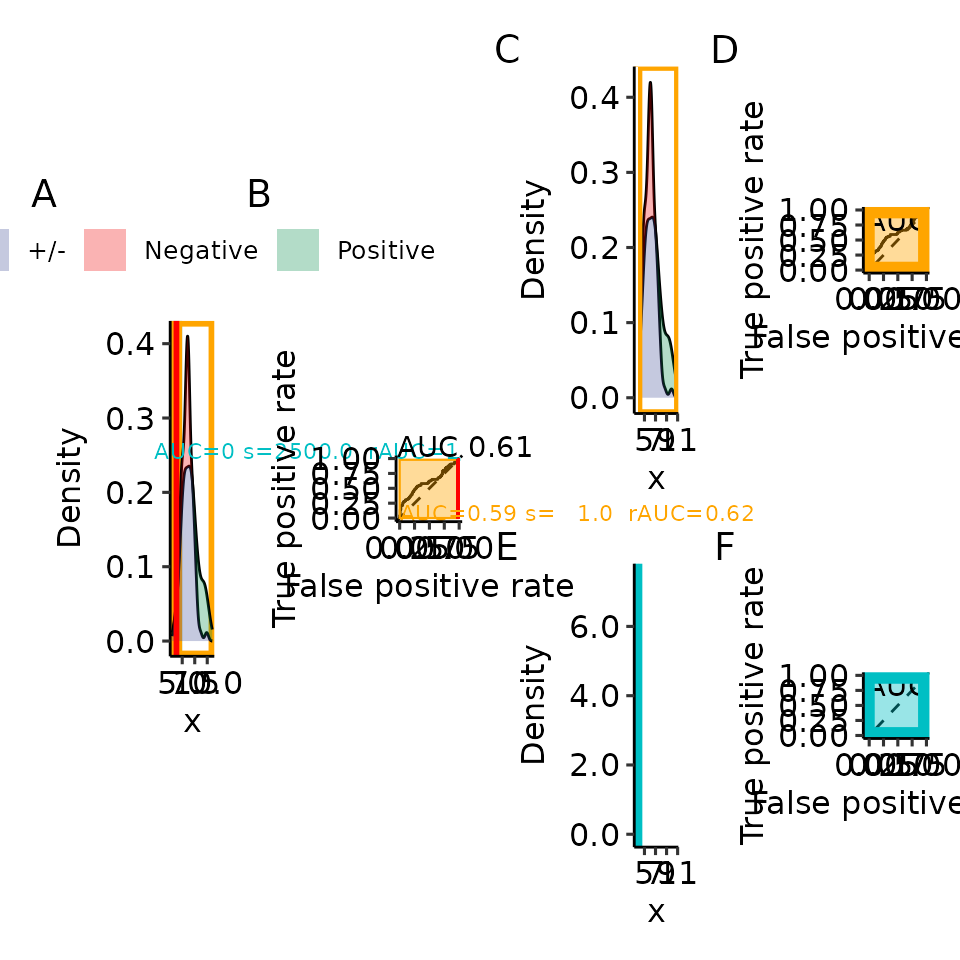
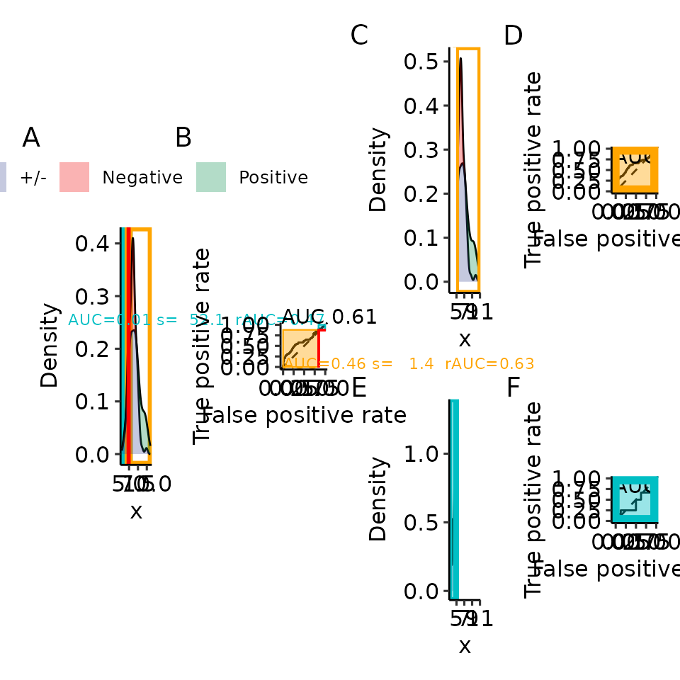
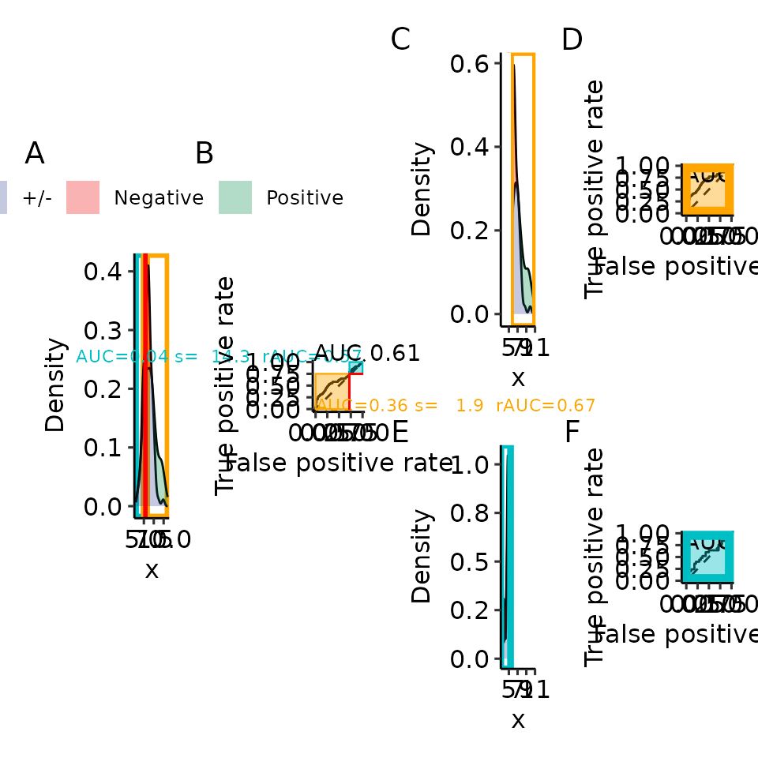
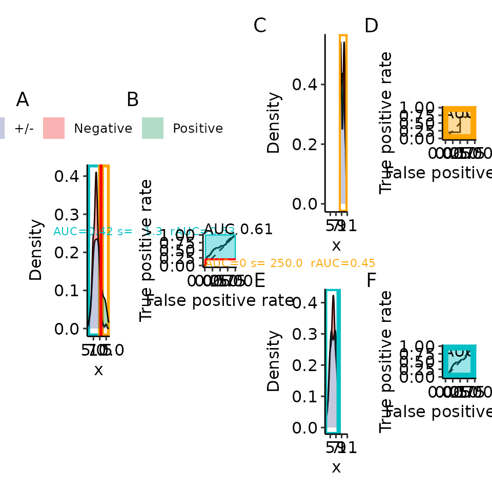

# Paper 06: rROC scaling/recalculating

``` r
options(warn = 1)
library(restrictedROC)
library(dplyr)
#> 
#> Attaching package: 'dplyr'
#> The following objects are masked from 'package:stats':
#> 
#>     filter, lag
#> The following objects are masked from 'package:base':
#> 
#>     intersect, setdiff, setequal, union
library(tibble)
library(ggplot2)

dir.create("res/paper", recursive = TRUE)
#> Warning in dir.create("res/paper", recursive = TRUE): 'res/paper' already
#> exists
main_plotname <- "res/paper/proc_rroc_"
```

## Scaling and recalculating leads to the same rAUC, shown visually

Applying our scaling factor to the partial AUC from the complete ROC
curve is exactly the same as recalculating the AUC on the respective
part of the values. If you have `ImageMagick` installed you can recreate
the GIF we presented in our publication

``` r
current_sim <- function(dists) {
    restrictedROC::sim(dists, do_melt = FALSE, length.out = 100)
}
set.seed(129387)
simdata <- current_sim(
    list(
        "Positive" = function(length.out) {
            unif <- runif(length.out)
            vapply(unif, function(x) {
                if (x > .2) {
                    rnorm(1, mean = 6, sd = 1)
                } else {
                    rnorm(1, mean = 9, sd = 1)
                }
            }, numeric(1))
        },
        "Negative" = function(length.out) {
            unif <- runif(length.out)
            vapply(unif, function(x) {
                if (x > .02) {
                    rnorm(1, mean = 6, sd = 1)
                } else {
                    rnorm(1, mean = 9, sd = 1)
                }
            }, numeric(1))
        }
    )
)

simdata_melted <- restrictedROC::melt_gendata(simdata)
colnames(simdata_melted) <- c("predictions", "response")
simdata_melted$labels <- as.numeric(simdata_melted$response == "Positive")
simple_df <- simdata_melted
rroc <- restrictedROC::rROC(
    simple_df,
    positive_label = "Positive",
    direction = "<",
    return_proc = TRUE,
    independent_vars = "predictions",
    dependent_vars = "response",
    n_permutations = 0
)[["response"]][["predictions"]][["permutation"]]
#> Fri Jan  9 14:51:57 2026      response predictions ( 1 )

include_part_auc_text <- TRUE
plot_scale <- 1.5

roc_data_df <- data.frame(
    "original.predictor" = rroc[["pROC_full"]][["original.predictor"]],
    "original.response" = rroc[["pROC_full"]][["original.response"]]
)
splitted_data <- split(roc_data_df[["original.predictor"]], roc_data_df[["original.response"]])
names(splitted_data) <- c("Negative", "Positive")
p_full_density_ROC <- plot_density_ROC_empirical(
    values_grouped = splitted_data,
    length.out = 1000,
    xmin = 3, xmax = 11,
    direction = "<",
    levels = c("Negative", "Positive")
)
# pdf(paste0(main_plotname, "p07_rroc_proc_scaling.pdf"), width = 8 * plot_scale, height = 4 * plot_scale)
# for (threshold_x in rroc$pROC_full$thresholds[5:185]) {  # all valid values
for (threshold_x in rroc$pROC_full$thresholds[5:185][c(1, 10, 25, 50, 75, 100, 125, 150, 175)]) {
    p_rroc_part <- plot_rROC_part(
        rroc,
        p_full_density_ROC = p_full_density_ROC,
        threshold = threshold_x,
        include_part_auc_text = TRUE
    )
    print(p_rroc_part$patchworked + patchwork::plot_annotation(tag_levels = "A"))
}
#> Warning in is.na(p_full_density_ROC): is.na() applied to non-(list or vector)
#> of type 'object'
#> Ignoring unknown labels:
#> • colour : ""
#> Ignoring unknown labels:
#> • colour : ""
#> Ignoring unknown labels:
#> • colour : ""
```



    #> Warning in is.na(p_full_density_ROC): is.na() applied to non-(list or vector)
    #> of type 'object'
    #> Ignoring unknown labels:
    #> • colour : ""
    #> Ignoring unknown labels:
    #> • colour : ""
    #> Ignoring unknown labels:
    #> • colour : ""


    #> Warning in is.na(p_full_density_ROC): is.na() applied to non-(list or vector)
    #> of type 'object'
    #> Ignoring unknown labels:
    #> • colour : ""
    #> Ignoring unknown labels:
    #> • colour : ""
    #> Ignoring unknown labels:
    #> • colour : ""



    #> Warning in is.na(p_full_density_ROC): is.na() applied to non-(list or vector)
    #> of type 'object'
    #> Ignoring unknown labels:
    #> • colour : ""
    #> Ignoring unknown labels:
    #> • colour : ""
    #> Ignoring unknown labels:
    #> • colour : ""



    #> Warning in is.na(p_full_density_ROC): is.na() applied to non-(list or vector)
    #> of type 'object'
    #> Ignoring unknown labels:
    #> • colour : ""
    #> Ignoring unknown labels:
    #> • colour : ""
    #> Ignoring unknown labels:
    #> • colour : ""


    #> Warning in is.na(p_full_density_ROC): is.na() applied to non-(list or vector)
    #> of type 'object'
    #> Ignoring unknown labels:
    #> • colour : ""
    #> Ignoring unknown labels:
    #> • colour : ""
    #> Ignoring unknown labels:
    #> • colour : ""


    #> Warning in is.na(p_full_density_ROC): is.na() applied to non-(list or vector)
    #> of type 'object'
    #> Ignoring unknown labels:
    #> • colour : ""
    #> Ignoring unknown labels:
    #> • colour : ""
    #> Ignoring unknown labels:
    #> • colour : ""


    #> Warning in is.na(p_full_density_ROC): is.na() applied to non-(list or vector)
    #> of type 'object'
    #> Ignoring unknown labels:
    #> • colour : ""
    #> Ignoring unknown labels:
    #> • colour : ""
    #> Ignoring unknown labels:
    #> • colour : ""


    #> Warning in is.na(p_full_density_ROC): is.na() applied to non-(list or vector)
    #> of type 'object'
    #> Ignoring unknown labels:
    #> • colour : ""
    #> Ignoring unknown labels:
    #> • colour : ""
    #> Ignoring unknown labels:
    #> • colour : ""



``` r
# dev.off()


# The following can only be done if imagemagick is installed
# # apt install ImageMagick
# command <- paste0("convert -verbose -delay 15 -loop 0 -density 100 ", paste0(main_plotname, "p07_rroc_proc_scaling.pdf"), " ", paste0(main_plotname, "p07_rroc_proc_scaling.gif"))
# system(command)
```
