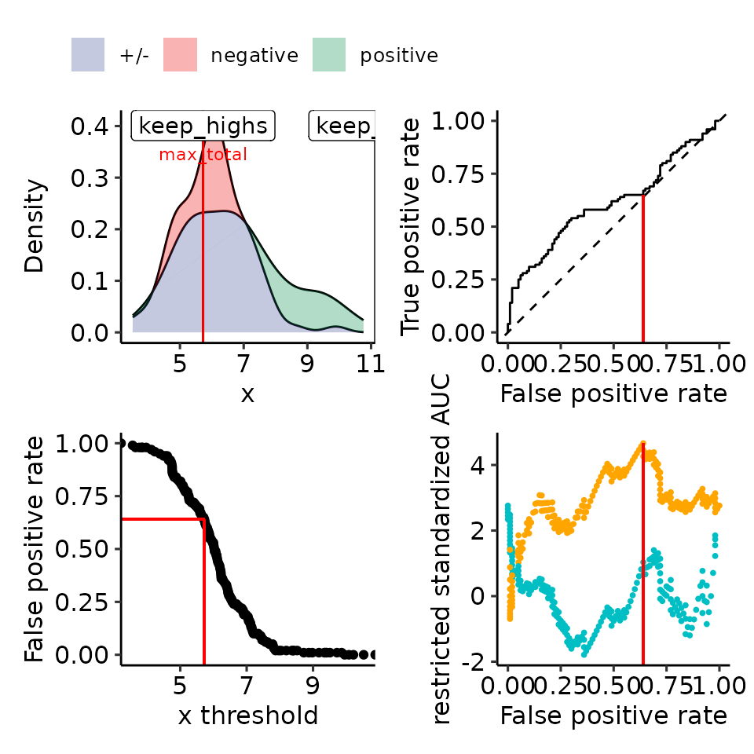

# Paper 07: rROC label swap

``` r
options(warn = 1)
library(restrictedROC)
```

## rROC is identical regardless of which is the positive label

``` r
current_sim <- function(dists) {
    # restrictedROC::sim(dists, do_melt = FALSE, length.out = 2500)
    restrictedROC::sim(dists, do_melt = FALSE, length.out = 100)
}
set.seed(129387)
simdata <- current_sim(
    list(
        "positive" = function(length.out) {
            unif <- runif(length.out)
            vapply(unif, function(x) {
                if (x > .2) {
                    rnorm(1, mean = 6, sd = 1)
                } else {
                    rnorm(1, mean = 9, sd = 1)
                }
            }, numeric(1))
        },
        "negative" = function(length.out) {
            unif <- runif(length.out)
            vapply(unif, function(x) {
                if (x > .02) {
                    rnorm(1, mean = 6, sd = 1)
                } else {
                    rnorm(1, mean = 9, sd = 1)
                }
            }, numeric(1))
        }
    )
)

simdata_melted <- restrictedROC::melt_gendata(simdata)
colnames(simdata_melted) <- c("predictor", "response")
plots_rroc_way_1 <- restrictedROC::plot_density_rROC_empirical(
    values_grouped = simdata,
    direction = "<",
    positive_label = "positive"
)
plots_rroc_way_2 <- restrictedROC::plot_density_rROC_empirical(
    values_grouped = simdata,
    direction = "<",
    positive_label = "negative"
)

# pdf("rzAUC_twoway_sim.pdf", height = 6, width = 6)
print(plots_rroc_way_1[["plots"]] + ggplot2::theme(legend.position = "none"))
#> Ignoring unknown labels:
#> • colour : ""
```



``` r
print(plots_rroc_way_2[["plots"]] + ggplot2::theme(legend.position = "none"))
#> Ignoring unknown labels:
#> • colour : ""
```


``` r
# dev.off()
```
