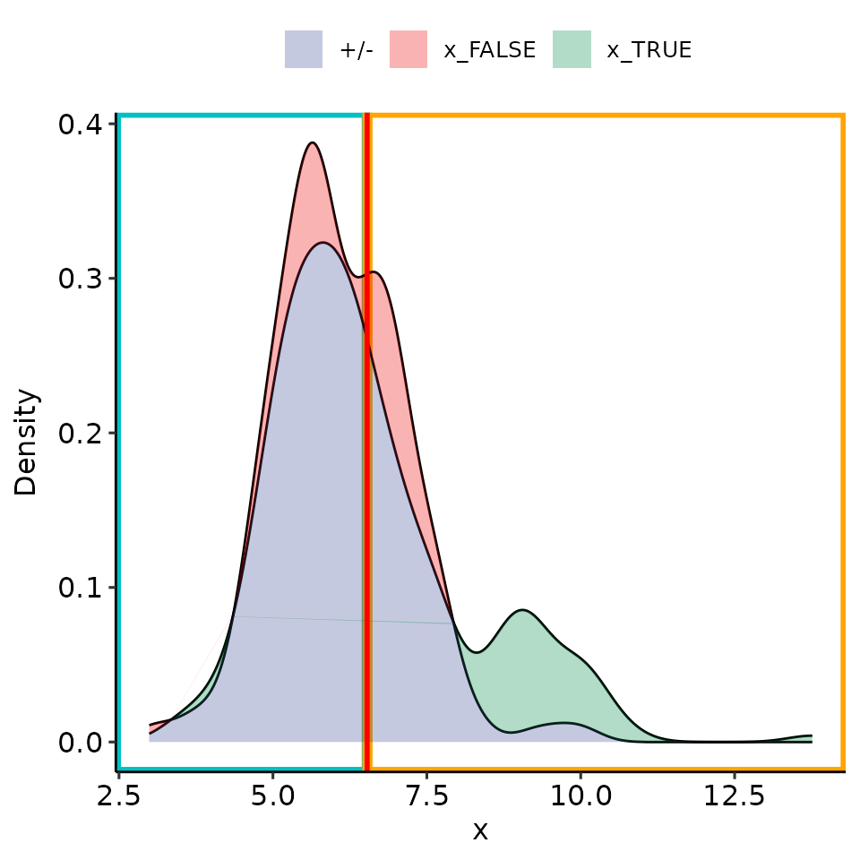
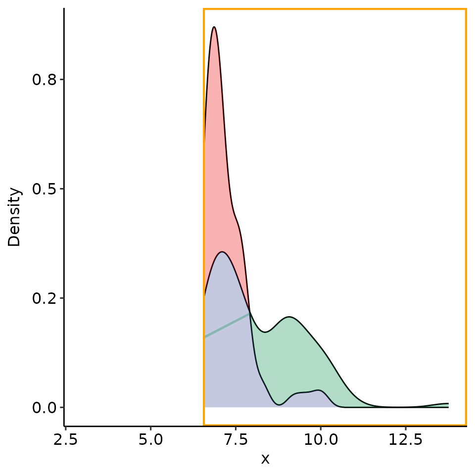
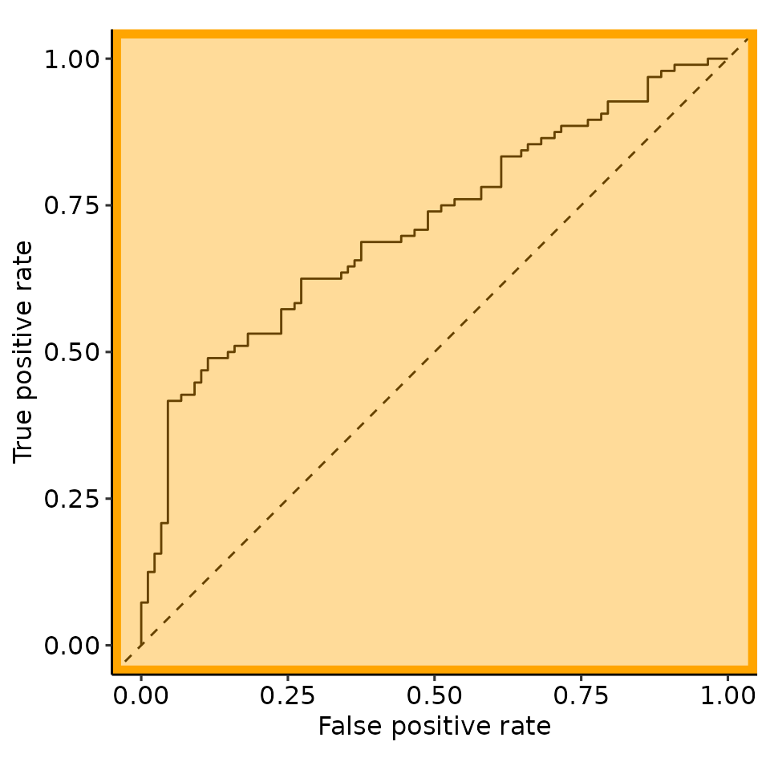
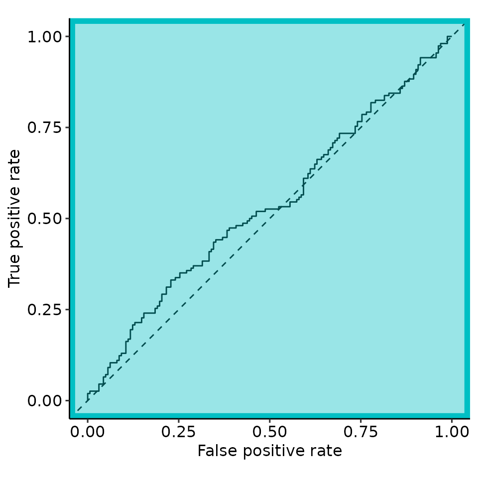
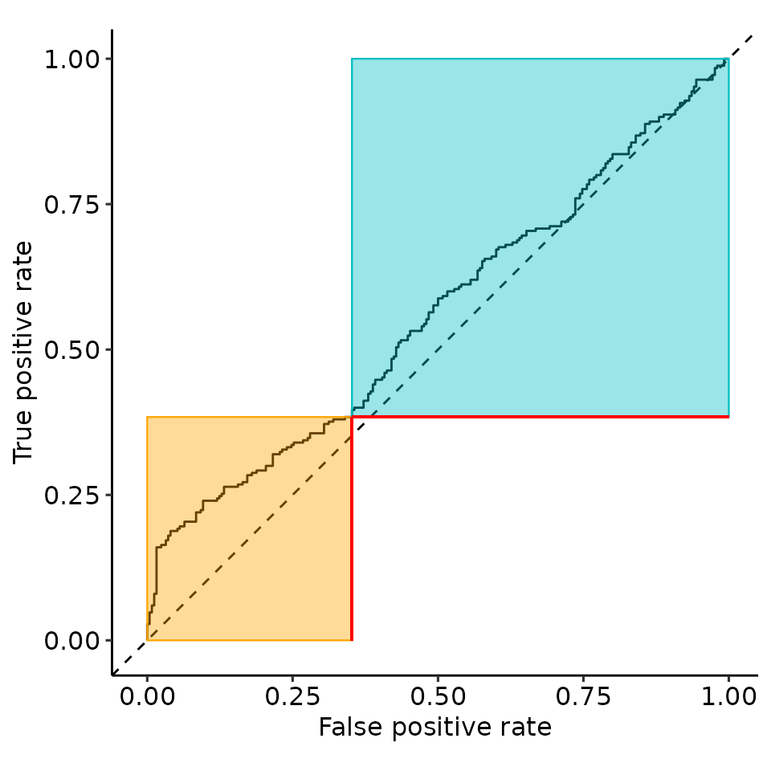
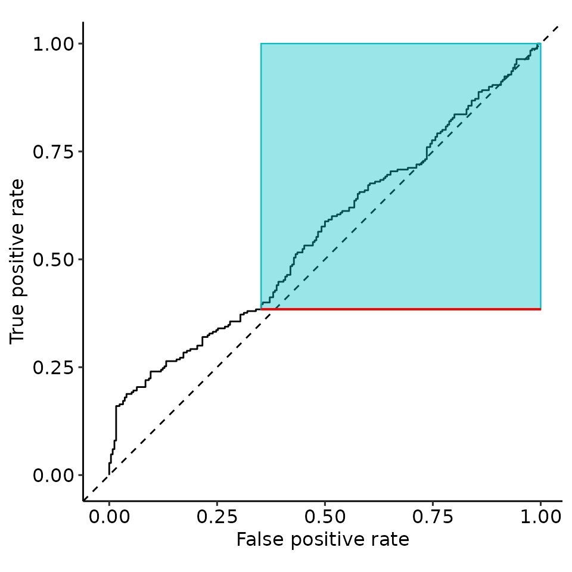

# Paper 09: rROC concept

``` r
options(warn = 1)
library(restrictedROC)
```

``` r
current_sim <- function(dists) {
    # restrictedROC::sim(dists, do_melt = FALSE, length.out = 2500)
    restrictedROC::sim(dists, do_melt = FALSE, length.out = 250)
}
set.seed(129387)
simdata <- current_sim(
    list(
        "Positive" = function(length.out) {
            unif <- runif(length.out)
            vapply(unif, function(x) {
                if (x > .2) {
                    rnorm(1, mean = 6, sd = 1)
                } else {
                    rnorm(1, mean = 9, sd = 1)
                }
            }, numeric(1))
        },
        "Negative" = function(length.out) {
            unif <- runif(length.out)
            vapply(unif, function(x) {
                if (x > .02) {
                    rnorm(1, mean = 6, sd = 1)
                } else {
                    rnorm(1, mean = 9, sd = 1)
                }
            }, numeric(1))
        }
    )
)

simdata_melted <- restrictedROC::melt_gendata(simdata)
colnames(simdata_melted) <- c("predictor", "response")
rroc <- restrictedROC::simple_rROC(
    response = simdata_melted[["response"]],
    predictor = simdata_melted[["predictor"]],
    positive_label = "Positive",
    direction = "<",
    return_proc = TRUE
)
rroc_interpret <- restrictedROC::simple_rROC_interpret(
    rroc,
    use_abs_rzAUC = TRUE # is default
)
point_25 <- rroc_interpret$performance[which.max(rroc_interpret$performance[["rzAUC_high"]]), ]
rroc_plots <- plot_rROC_part(
    rroc,
    threshold = point_25[["threshold"]]
)
# pdf("cartoon_complete.pdf", height = 3, width = 3)
print(rroc_plots)
#> $plotlist
#> $plotlist$A
#> Ignoring unknown labels:
#> • colour : ""
```



    #> 
    #> $plotlist$B


    #> 
    #> $plotlist$C
    #> Ignoring unknown labels:
    #> • colour : ""



    #> 
    #> $plotlist$D



    #> 
    #> $plotlist$E
    #> Ignoring unknown labels:
    #> • colour : ""


    #> 
    #> $plotlist$F



    #> 
    #> 
    #> $patchworked
    #> Ignoring unknown labels:
    #> • colour : ""
    #> Ignoring unknown labels:
    #> • colour : ""
    #> Ignoring unknown labels:
    #> • colour : ""


``` r
print(rroc_plots[["plotlist"]][[2]])
```



``` r
tmp <- rroc_plots[["plotlist"]][[2]]
tmp$layers[[6]] <- NULL
tmp$layers[[4]] <- NULL
print(tmp)
```


``` r
tmp <- rroc_plots[["plotlist"]][[2]]
tmp$layers[[5]] <- NULL
tmp$layers[[3]] <- NULL
print(tmp)
```



``` r
# dev.off()
```

``` r
set.seed(129487)
simdata_validation <- current_sim(
    list(
        "Positive" = function(length.out) {
            unif <- runif(length.out)
            vapply(unif, function(x) {
                if (x > .2) {
                    rnorm(1, mean = 6, sd = 1)
                } else {
                    rnorm(1, mean = 9, sd = 1)
                }
            }, numeric(1))
        },
        "Negative" = function(length.out) {
            unif <- runif(length.out)
            vapply(unif, function(x) {
                if (x > .02) {
                    rnorm(1, mean = 6, sd = 1)
                } else {
                    rnorm(1, mean = 9, sd = 1)
                }
            }, numeric(1))
        }
    )
)
simdata_validation_melted <- restrictedROC::melt_gendata(simdata_validation)
simdata_validation_melted[["response_binary"]] <- simdata_validation_melted[["Distribution"]] == "Positive"
preds <- predict(
    rroc_interpret,
    newdata = simdata_validation_melted,
    newdata_predictor_column = "Value",
    newdata_response_column = "response_binary",
    pred_high_label = TRUE,
    pred_low_label = FALSE
)
print(preds[["table_full"]])
#>          response
#> pred_full TRUE FALSE
#>     TRUE    35    11
#>     FALSE  215   239
print(preds[["table_restricted"]])
#>          response
#> pred_kept TRUE FALSE
#>     TRUE    35    11
#>     FALSE   52    66
print(preds[["tab_classifiable"]])
#> NULL
print(names(preds))
#> [1] "table_full"                "table_restricted"         
#> [3] "pred"                      "threshold_and_restriction"
#> [5] "restriction_part"          "table_classifiable"
```
