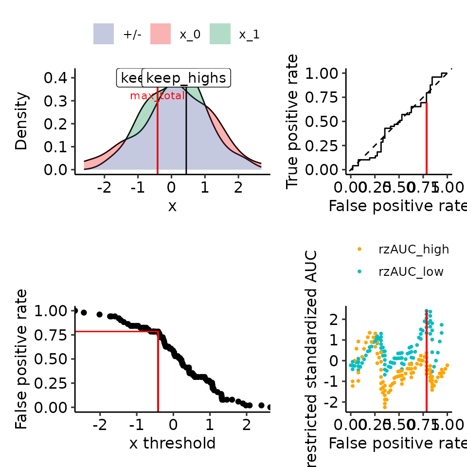
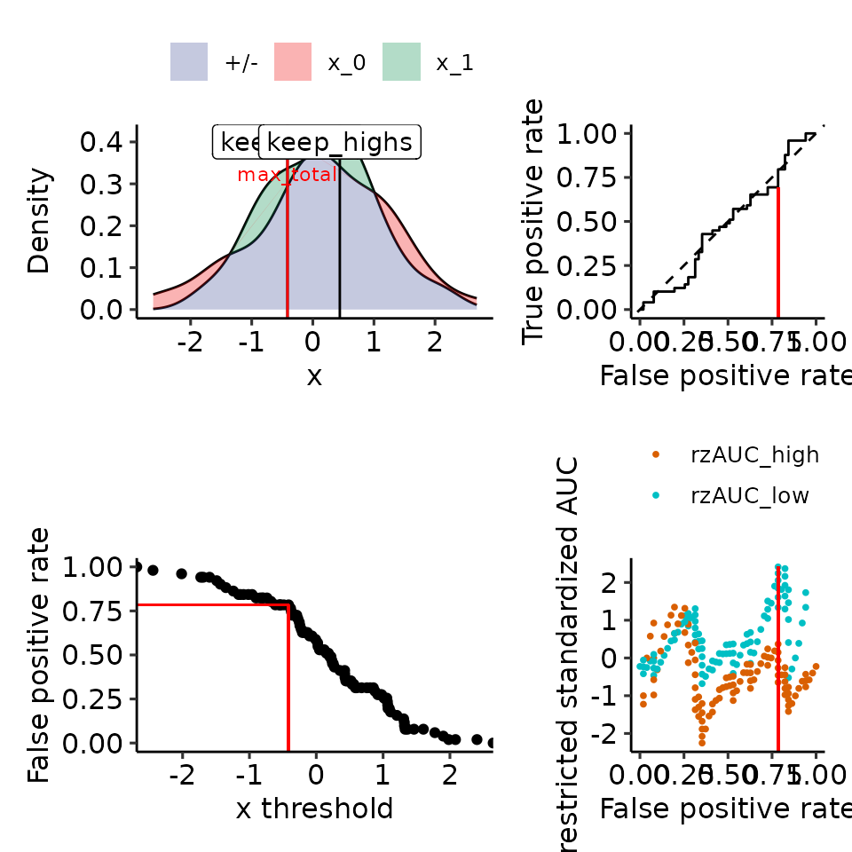

# Vignette 01: rzAUC colors

``` r
options(warn = 1)
library(restrictedROC)
```

``` r
n_samples <- 100
n_features <- 1
random_df <- data.frame(
    "response" = sample(c(0, 1), size = n_samples, replace = TRUE),
    as.data.frame(matrix(rnorm(n_samples * n_features), nrow = n_samples, ncol = n_features))
)

dependent_vars <- "response"
independent_vars <- colnames(random_df)[colnames(random_df) != "response"]

reslist <- list()
for (dv in dependent_vars) {
    reslist[[dv]] <- list()
    for (iv in independent_vars) {
        cat(date(), "    ", dv, iv, "\n")
        df <- tibble::tibble(
            "response" = random_df[[dv]],
            "predictor" = random_df[[iv]]
        )
        per_resp_list <- split(df$predictor, df$response)
    }
}
#> Thu Jan  8 12:38:15 2026      response V1


# pdf(file.path("res", "rzAUC_colors.pdf"))
print(
    plot_density_rROC_empirical(
        rev(per_resp_list),
        xmin = min(df$predictor),
        xmax = max(df$predictor),
        positive_label = 1,
        direction = "<"
    )
)
#> $plots
#> Ignoring unknown labels:
#> • colour : ""
```



    #> 
    #> $single_rROC
    #> $performances
    #> # A tibble: 101 × 21
    #>    threshold auc_high positives_high negatives_high scaling_high auc_var_H0_high
    #>        <dbl>    <dbl>          <dbl>          <dbl>        <dbl>           <dbl>
    #>  1   -Inf       0.487             49             51         1            0.00337
    #>  2     -2.44    0.477             49             50         1.02         0.00340
    #>  3     -2.02    0.466             49             49         1.04         0.00344
    #>  4     -1.73    0.455             49             48         1.06         0.00347
    #>  5     -1.69    0.464             48             48         1.08         0.00351
    #>  6     -1.60    0.474             47             48         1.11         0.00355
    #>  7     -1.49    0.463             47             47         1.13         0.00358
    #>  8     -1.44    0.451             47             46         1.16         0.00362
    #>  9     -1.35    0.439             47             45         1.18         0.00366
    #> 10     -1.24    0.426             47             44         1.21         0.00371
    #> # ℹ 91 more rows
    #> # ℹ 15 more variables: rzAUC_high <dbl>, pval_asym_onesided_high <dbl>,
    #> #   pval_asym_high <dbl>, auc_low <dbl>, positives_low <dbl>,
    #> #   negatives_low <dbl>, scaling_low <dbl>, auc_var_H0_low <dbl>,
    #> #   rzAUC_low <dbl>, pval_asym_onesided_low <dbl>, pval_asym_low <dbl>,
    #> #   tp <dbl>, fp <dbl>, tpr_global <dbl>, fpr_global <dbl>
    #> 
    #> $global
    #>         auc auc_var_H0     rzAUC pval_asym
    #> 1 0.4869948  0.4869948 -0.224094 0.8226842
    #> 
    #> $keep_highs
    #>         auc  auc_var_H0     rzAUC  pval_asym threshold
    #> 1 0.2883598 0.008818342 -2.253745 0.02421223 0.4416718
    #> 
    #> $keep_lows
    #>         auc auc_var_H0    rzAUC  pval_asym  threshold
    #> 1 0.7818182 0.01363636 2.413347 0.01580677 -0.4145065
    #> 
    #> $max_total
    #>         auc auc_var_H0    rzAUC  pval_asym  threshold part
    #> 1 0.7818182 0.01363636 2.413347 0.01580677 -0.4145065  low
    #> 
    #> $positive_label
    #> [1] 1
    #> 
    #> $pROC_full
    #> 
    #> Call:
    #> roc.default(response = true_pred_df[["true"]], predictor = true_pred_df[["pred"]],     levels = c(FALSE, TRUE), direction = direction)
    #> 
    #> Data: true_pred_df[["pred"]] in 51 controls (true_pred_df[["true"]] FALSE) < 49 cases (true_pred_df[["true"]] TRUE).
    #> Area under the curve: 0.487
    #> 
    #> attr(,"class")
    #> [1] "restrictedROC" "list"
    print(
        plot_density_rROC_empirical(
            rev(per_resp_list),
            xmin = min(df$predictor),
            xmax = max(df$predictor),
            positive_label = 1,
            direction = "<",
            part_colors = c(high = "#d95f02", low = "#00BFC4")
        )
    )
    #> $plots
    #> Ignoring unknown labels:
    #> • colour : ""



    #> 
    #> $single_rROC
    #> $performances
    #> # A tibble: 101 × 21
    #>    threshold auc_high positives_high negatives_high scaling_high auc_var_H0_high
    #>        <dbl>    <dbl>          <dbl>          <dbl>        <dbl>           <dbl>
    #>  1   -Inf       0.487             49             51         1            0.00337
    #>  2     -2.44    0.477             49             50         1.02         0.00340
    #>  3     -2.02    0.466             49             49         1.04         0.00344
    #>  4     -1.73    0.455             49             48         1.06         0.00347
    #>  5     -1.69    0.464             48             48         1.08         0.00351
    #>  6     -1.60    0.474             47             48         1.11         0.00355
    #>  7     -1.49    0.463             47             47         1.13         0.00358
    #>  8     -1.44    0.451             47             46         1.16         0.00362
    #>  9     -1.35    0.439             47             45         1.18         0.00366
    #> 10     -1.24    0.426             47             44         1.21         0.00371
    #> # ℹ 91 more rows
    #> # ℹ 15 more variables: rzAUC_high <dbl>, pval_asym_onesided_high <dbl>,
    #> #   pval_asym_high <dbl>, auc_low <dbl>, positives_low <dbl>,
    #> #   negatives_low <dbl>, scaling_low <dbl>, auc_var_H0_low <dbl>,
    #> #   rzAUC_low <dbl>, pval_asym_onesided_low <dbl>, pval_asym_low <dbl>,
    #> #   tp <dbl>, fp <dbl>, tpr_global <dbl>, fpr_global <dbl>
    #> 
    #> $global
    #>         auc auc_var_H0     rzAUC pval_asym
    #> 1 0.4869948  0.4869948 -0.224094 0.8226842
    #> 
    #> $keep_highs
    #>         auc  auc_var_H0     rzAUC  pval_asym threshold
    #> 1 0.2883598 0.008818342 -2.253745 0.02421223 0.4416718
    #> 
    #> $keep_lows
    #>         auc auc_var_H0    rzAUC  pval_asym  threshold
    #> 1 0.7818182 0.01363636 2.413347 0.01580677 -0.4145065
    #> 
    #> $max_total
    #>         auc auc_var_H0    rzAUC  pval_asym  threshold part
    #> 1 0.7818182 0.01363636 2.413347 0.01580677 -0.4145065  low
    #> 
    #> $positive_label
    #> [1] 1
    #> 
    #> $pROC_full
    #> 
    #> Call:
    #> roc.default(response = true_pred_df[["true"]], predictor = true_pred_df[["pred"]],     levels = c(FALSE, TRUE), direction = direction)
    #> 
    #> Data: true_pred_df[["pred"]] in 51 controls (true_pred_df[["true"]] FALSE) < 49 cases (true_pred_df[["true"]] TRUE).
    #> Area under the curve: 0.487
    #> 
    #> attr(,"class")
    #> [1] "restrictedROC" "list"
    print(
        plot_density_rROC_empirical(
            rev(per_resp_list),
            xmin = min(df$predictor),
            xmax = max(df$predictor),
            positive_label = 1,
            direction = "<",
            part_colors = c(high = "yellow", low = "brown")
        )
    )
    #> $plots
    #> Ignoring unknown labels:
    #> • colour : ""


    #> 
    #> $single_rROC
    #> $performances
    #> # A tibble: 101 × 21
    #>    threshold auc_high positives_high negatives_high scaling_high auc_var_H0_high
    #>        <dbl>    <dbl>          <dbl>          <dbl>        <dbl>           <dbl>
    #>  1   -Inf       0.487             49             51         1            0.00337
    #>  2     -2.44    0.477             49             50         1.02         0.00340
    #>  3     -2.02    0.466             49             49         1.04         0.00344
    #>  4     -1.73    0.455             49             48         1.06         0.00347
    #>  5     -1.69    0.464             48             48         1.08         0.00351
    #>  6     -1.60    0.474             47             48         1.11         0.00355
    #>  7     -1.49    0.463             47             47         1.13         0.00358
    #>  8     -1.44    0.451             47             46         1.16         0.00362
    #>  9     -1.35    0.439             47             45         1.18         0.00366
    #> 10     -1.24    0.426             47             44         1.21         0.00371
    #> # ℹ 91 more rows
    #> # ℹ 15 more variables: rzAUC_high <dbl>, pval_asym_onesided_high <dbl>,
    #> #   pval_asym_high <dbl>, auc_low <dbl>, positives_low <dbl>,
    #> #   negatives_low <dbl>, scaling_low <dbl>, auc_var_H0_low <dbl>,
    #> #   rzAUC_low <dbl>, pval_asym_onesided_low <dbl>, pval_asym_low <dbl>,
    #> #   tp <dbl>, fp <dbl>, tpr_global <dbl>, fpr_global <dbl>
    #> 
    #> $global
    #>         auc auc_var_H0     rzAUC pval_asym
    #> 1 0.4869948  0.4869948 -0.224094 0.8226842
    #> 
    #> $keep_highs
    #>         auc  auc_var_H0     rzAUC  pval_asym threshold
    #> 1 0.2883598 0.008818342 -2.253745 0.02421223 0.4416718
    #> 
    #> $keep_lows
    #>         auc auc_var_H0    rzAUC  pval_asym  threshold
    #> 1 0.7818182 0.01363636 2.413347 0.01580677 -0.4145065
    #> 
    #> $max_total
    #>         auc auc_var_H0    rzAUC  pval_asym  threshold part
    #> 1 0.7818182 0.01363636 2.413347 0.01580677 -0.4145065  low
    #> 
    #> $positive_label
    #> [1] 1
    #> 
    #> $pROC_full
    #> 
    #> Call:
    #> roc.default(response = true_pred_df[["true"]], predictor = true_pred_df[["pred"]],     levels = c(FALSE, TRUE), direction = direction)
    #> 
    #> Data: true_pred_df[["pred"]] in 51 controls (true_pred_df[["true"]] FALSE) < 49 cases (true_pred_df[["true"]] TRUE).
    #> Area under the curve: 0.487
    #> 
    #> attr(,"class")
    #> [1] "restrictedROC" "list"
    # dev.off()
