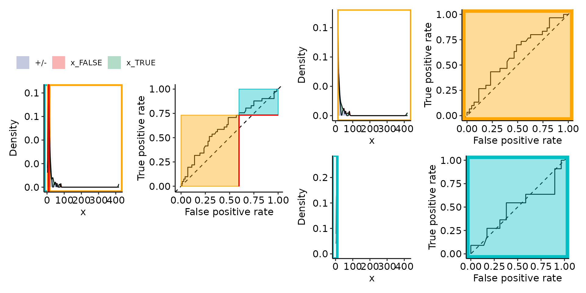

# Vignette 02: Restriction plots

``` r
options(warn = 1)
library(restrictedROC)
```

``` r
data(aSAH, package = "pROC")

# In this here are three warnings:
# Warning messages:
# 1: In get_all_aucs_fun(full_roc = full_roc, true_pred_df = true_pred_df,  :
#   get_all_aucs_norecalculation() does not calculate single ROC curves, therefore cannot return them
# 2: In get_all_aucs_fun(full_roc = full_roc, true_pred_df = true_pred_df,  :
#   get_all_aucs_norecalculation() does not calculate single ROC curves, therefore cannot return them
# 3: In plot_rROC_part(ret_procs) :
# Threshold
#   10
# not found, using the closest instead:
#   9.9
ret_procs <- simple_rROC(
    response = aSAH$outcome,
    predictor = aSAH$ndka,
    return_proc = TRUE
)
#> Positive label not given, setting to last level of factor: Poor
print(plot_rROC_part(ret_procs, threshold = 10))
#> Warning in plot_rROC_part_single(x, ...): 
#> Threshold 
#>   10
#> not found, using the closest instead:
#>   9.9
#> $plotlist
#> $plotlist$A
#> Ignoring unknown labels:
#> • colour : ""
```


    #> 
    #> $plotlist$B


    #> 
    #> $plotlist$C
    #> Ignoring unknown labels:
    #> • colour : ""


    #> 
    #> $plotlist$D


    #> 
    #> $plotlist$E
    #> Ignoring unknown labels:
    #> • colour : ""


    #> 
    #> $plotlist$F


    #> 
    #> 
    #> $patchworked
    #> Ignoring unknown labels:
    #> • colour : ""
    #> Ignoring unknown labels:
    #> • colour : ""
    #> Ignoring unknown labels:
    #> • colour : ""



``` r
current_sim <- function(dists) {
    # restrictedROC::sim(dists, do_melt = FALSE, length.out = 2500)
    restrictedROC::sim(dists, do_melt = FALSE, length.out = 100)
}
set.seed(129387)
simdata <- current_sim(
    list(
        "Positive" = function(length.out) {
            unif <- runif(length.out)
            vapply(unif, function(x) {
                if (x > .2) {
                    rnorm(1, mean = 6, sd = 1)
                } else {
                    rnorm(1, mean = 9, sd = 1)
                }
            }, numeric(1))
        },
        "Negative" = function(length.out) {
            unif <- runif(length.out)
            vapply(unif, function(x) {
                if (x > .02) {
                    rnorm(1, mean = 6, sd = 1)
                } else {
                    rnorm(1, mean = 9, sd = 1)
                }
            }, numeric(1))
        }
    )
)

simdata_melted <- restrictedROC::melt_gendata(simdata)
colnames(simdata_melted) <- c("predictor", "response")
rroc <- restrictedROC::simple_rROC(
    response = simdata_melted[["response"]],
    predictor = simdata_melted[["predictor"]],
    positive_label = "Positive",
    direction = "<",
    return_proc = TRUE
)
rroc_interpret <- restrictedROC::simple_rROC_interpret(
    rroc,
    use_abs_rzAUC = TRUE # is default
)
point_25 <- rroc_interpret$performance[which.max(rroc_interpret$performance[["rzAUC_high"]]), ]
rroc_plots <- plot_rROC_part(
    rroc,
    fpr = point_25[["fpr_global"]]
)
rroc_plots_threshold <- plot_rROC_part(
    rroc,
    threshold = point_25[["threshold"]]
)
# pdf("removeme.pdf", width=15)
print(rroc_plots$patchworked)
#> Ignoring unknown labels:
#> • colour : ""
#> Ignoring unknown labels:
#> • colour : ""
#> Ignoring unknown labels:
#> • colour : ""
```


``` r
print(rroc_plots_threshold$patchworked)
#> Ignoring unknown labels:
#> • colour : ""
#> Ignoring unknown labels:
#> • colour : ""
#> Ignoring unknown labels:
#> • colour : ""
```


``` r
# dev.off()
```
